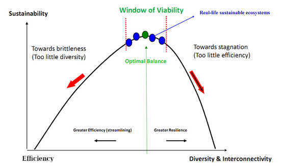
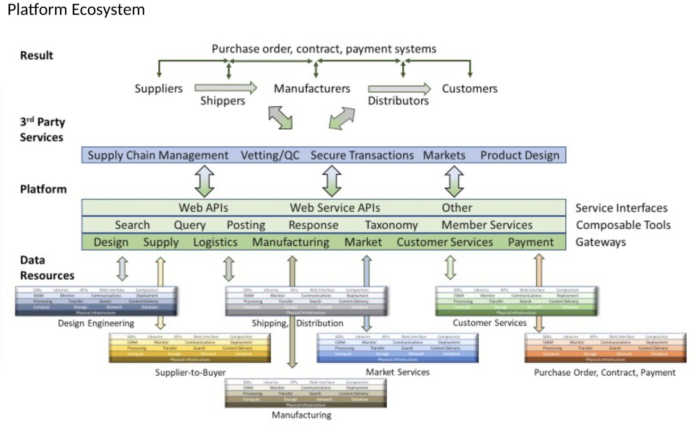

<!-- Output copied to clipboard! -->

<!-----

You have some errors, warnings, or alerts. If you are using reckless mode, turn it off to see inline alerts.
* ERRORs: 0
* WARNINGs: 0
* ALERTS: 5

Conversion time: 5.319 seconds.


Using this Markdown file:

1. Paste this output into your source file.
2. See the notes and action items below regarding this conversion run.
3. Check the rendered output (headings, lists, code blocks, tables) for proper
   formatting and use a linkchecker before you publish this page.

Conversion notes:

* Docs to Markdown version 1.0β33
* Wed May 11 2022 10:01:27 GMT-0700 (PDT)
* Source doc: HE Green Paper SCIS v3
* Tables are currently converted to HTML tables.
* This document has images: check for >>>>>  gd2md-html alert:  inline image link in generated source and store images to your server. NOTE: Images in exported zip file from Google Docs may not appear in  the same order as they do in your doc. Please check the images!

----->


<p style="color: red; font-weight: bold">>>>>>  gd2md-html alert:  ERRORs: 0; WARNINGs: 0; ALERTS: 5.</p>
<ul style="color: red; font-weight: bold"><li>See top comment block for details on ERRORs and WARNINGs. <li>In the converted Markdown or HTML, search for inline alerts that start with >>>>>  gd2md-html alert:  for specific instances that need correction.</ul>

<p style="color: red; font-weight: bold">Links to alert messages:</p><a href="#gdcalert1">alert1</a>
<a href="#gdcalert2">alert2</a>
<a href="#gdcalert3">alert3</a>
<a href="#gdcalert4">alert4</a>
<a href="#gdcalert5">alert5</a>

<p style="color: red; font-weight: bold">>>>>> PLEASE check and correct alert issues and delete this message and the inline alerts.<hr></p>


##   

<p id="gdcalert1" ><span style="color: red; font-weight: bold">>>>>>  gd2md-html alert: inline image link here (to images/image1.png). Store image on your image server and adjust path/filename/extension if necessary. </span><br>(<a href="#">Back to top</a>)(<a href="#gdcalert2">Next alert</a>)<br><span style="color: red; font-weight: bold">>>>>> </span></p>


## <p style="text-align: right">
Publication number 001</p>


## <p style="text-align: right">
Green Paper Open-Knowledge-Framework for Supply Chain Interoperability Specification</p>


### Open Knowledge Framework


### Supply Chain Interoperability Specification


                                        <p style="text-align: right">
 Patrick Wilkie</p>


                                        <p style="text-align: right">
Peter Springsteen</p>


<p style="text-align: right">
Nathan Parker </p>


<p style="text-align: right">
Deepti Sawhney</p>


<p style="text-align: right">
Kevin Patel</p>


<p style="text-align: right">
Vinnie Kumala</p>


<p style="text-align: right">
Steven LoCicero, Ph.D.</p>


<p style="text-align: right">
Robert L. Read, Ph.D.</p>


<p style="text-align: right">
Raksha Thammaiah </p>


<p style="text-align: right">
Kevin Barrow</p>


<p style="text-align: right">
Sarah Abowitz </p>


<p style="text-align: right">
James Butler</p>


<p style="text-align: right">
Harry Pierson</p>


<p style="text-align: right">
<em>Helpful Engineering</em></p>


<p style="text-align: right">
Begun before Dec. 2020</p>


<p style="text-align: right">
April 2021</p>


										February 2022


## Disclaimer 

This Green Paper is a draft publication intended to inform and guide supply chain practitioners as to how the Supply Chain Interoperability Specification (SCIS) provides a framework to aid voluntary relief efforts while providing a benefit to existing and future commercial enterprises by allowing for the creation of an organization-independent, robust, and agile supply chain based on open source object templates. The plans herein are in no way binding, because this framework and its specifications may change over time. 

_ _

**Abstract**

The COVID-19 pandemic emphatically demonstrated that while global supply chains are cost-efficient, they are also profoundly fragile. An Open Know Framework (OKF) is proposed as a necessary component of resilient supply chains. The OKF allows production resources, including specifically makerspaces and small businesses, to be quickly and dynamically organized to produce acutely or critically needed open source products or components. The goals of the OKF are to make supply chains resilient, composable, agile and transparent. These goals are realized by a family of templates, which can be used together to define the necessary objects, processes and interactions to create a supply chain. Documents conformant to these templates create a catalog of products that can be quickly manufactured. A platform, which may be concierged by humans and evolved into a highly automated system, allows buyers to order products from a catalog and get them delivered. To ensure maximum agility when responding to acute supply chain disruption, the platform maps these requests onto an agile network of producers which can include makerspaces, large manufactures, local manufacturing facilities or microfactories in shipping containers. The platform turns a supply chain into a cyber physical system, albeit one that relies not on telemetry but recorded human assertion to track and manage the system.

**Key words**


* cyber-physical system
* smart grid
* mesh networking
* economics
* supply chain
* complexity
* network dynamics
* manufacturing
* risk mitigation


**Table of Contents**


[TOC]


[TOC]


```
List Of Tables
Table 1. Open Know How
Table 2. Open Know Where
```


[TOC]


```
List Of Images
Figure 1. Efficiency and resilience are opposing forces that need to be balanced towards optimality. From sustainable ecosystems and living organisms to mission-critical NASA space exploration projects, all enduring systems balance diversity and efficiency.
Figure 2. Supply Chain Interoperability Template
Figure 3. Platform Ecosystem
Figure 4. A diagram of the recursive dynamic supply chain for a chair, which also contains a dynamic supply chain for a seat.
Figure 5. System Layers
Figure 6. A circular economy is best understood as a cascade of larger and smaller loops. The shorter loops, intuitively, require less energy in manufacturing and transportation than the larger loops, and thus should be incentivized towards a more sustainable system.

```


## Glossary

_Note: _for terms not appearing in this glossary, please refer to the definitions contained in the [NIST Glossary](https://csrc.nist.gov/glossary) and evolving SCIS reference [Glossary](https://docs.google.com/spreadsheets/u/0/d/1-lhDR26kA5h4K39cFsqjxWT24dZP4m0QVrObRt1gRU0/edit) 

**Key Terms:**

**Digital sustainability** is the means by which digitalisation, as a key part of the fourth industrial revolution, can deliver on the global sustainability goals. These goals include shortening supply chains to reduce waste and carbon footprint, as well as enabling repair, reuse and recycling.

**Manufacturer** is any entity capable of fabrication, and encompasses specifically manufacturing firms and informal makerspaces.

A** Supply Chain Network **is the set of resources which can potentially participate in fulfilling orders that create dynamic supply chains.

A** Dynamic Supply Chain **refers to the parts of a Supply Chain Network which are connected together specifically by participation in fulfilling an order. A dynamic supply chain is analogous to a path in a graph, where the graph is the Supply Chain Network. 

**Supply Chain **is a widely used term colloquially that refers to both a Supply Chain Network and a Dynamic Supply Chain. We recommend avoiding this term in technical papers. 

**Supply Chain Interoperability (SCI) **is the degree to which various partial supply chains can be combined and recombined, measured in part by the time and energy required to do so. This can encompass various factors including regulatory and language barriers, differences in units of measure, manufacturing methods, and so on. 

**Supply Chain Interoperability Specification (SCIS)** is an interlocking set of data templates, as well as a set of workflow templates for using them, which as a whole are intended to increase the level of Supply Chain Interoperability between any parties who are using it.

**Framework** is a set of document templates which ease communication in a dynamic supply chain network through standardization.

**Open Know Framework** is a specific set of document templates proposed in this paper.

**Platform** is a system for matching buyers to sellers in a supply chain network based on supply chain interoperability specifications.


## Related Documents

We propose to explore the concepts of an interoperable and decentralized supply chain network based on the Open Knowledge Framework through 3 papers. First, this paper, the <span style="text-decoration:underline;">Open-Knowledge-Framework for Supply Chain Interoperability Specification,</span> explores templates needed to implement an Open Knowledge Framework enabling further exploration of how Open Knowledge products, processes, materials, and facility descriptions can enhance a system making it more lean, robust and efficient..  The second paper,  [HE Green Paper PPE](https://docs.google.com/document/d/1KKy3775BzmyYTWrZ1lfsHKaV2UmZHcAxQUiVcHnLabw/edit), dives deeper into the structure of a potential platform and provides a generalized example in the context of the COVID pandemic and critical PPE shortfall. The third paper, [HE Green Paper Microfactory Shipping Container Mesh Network](https://docs.google.com/document/d/1KKy3775BzmyYTWrZ1lfsHKaV2UmZHcAxQUiVcHnLabw/edit), explores the specific scenario of using distributed microfactories to supplement the traditional supply chain network, including an example of a fabrication design for a container factory. 


## 1 Problem Statement

The COVID-19 pandemic illustrates that our global supply chain network is profoundly fragile, and this systemic fragility poses a grave threat to the lives and prosperity of people all over the world. This ongoing crisis has challenged the world's ability to respond rapidly to threats and exposed vulnerabilities such as supply chain fragility, misinformation, fragility of repair networks, and severe geographic resource limitations,  that must be addressed to ensure economic security, and public health in the face of threats such as pandemics and war. As we are recovering from the current crisis, and prepare for the probability of the next, it is well past time to think about security and competitiveness as linked to our manufacturing, supply chain network, and workforce capabilities. [^1]

This paper proposes a framework of templates and an automatable platform for using them, which can allow supply chains to be more agile and dynamic, as well as responsive to crises and shortages. By transparently publishing knowledge via open templates which was previously closely held or by developing new reproducible instructions, we can make supply chain networks both more agile and geographically flexible, and therefore more resilient. These resilient supply chain networks have the potential to prevent deaths, reduce suffering caused by acute shortages in times of crisis, and facilitate economic activity during periods of normal operations.

Supply Chain Interoperability, or SCI, is important because supply chains can fail gracefully, or they can fail spectacularly, but they will fail sooner or later. Graceful degradation means that the overall decrease in the output of the system is predictably proportionate to the damage or disruption it sustains. A graceful failure may mean rationing and scarcity, but avoids a preventable mass casualty scenario. It is clear that supply chains will continue to be brittle as the world becomes increasingly unstable, so supply chain failures should be expected and planned for. We will continue to see the primary global supply chain fail under some shock, and connected to the places that are hardest hit, we will see people wanting to step in and fill the gaps. Grassroots engineering self-organized a cottage industry responsible for making tens of millions of units of PPE over 2020 [OSMS citation]. These were a combination of wholly ad-hoc supply chains, and situations where a number of ad-hoc elements, such as a makerspace as a local fabrication facility and distribution center, connected with elements of the larger supply chain. In every case, the ad hoc supply chain wasted a staggering amount of time and energy and money getting these elements to work together effectively. Put another way, with a relatively low degree of Supply Chain Interoperability, tens of thousands of people still managed to design, fabricate, and ship tens of millions of units of something that the traditional supply chain wholly failed to provide. Imagine what would be possible with a much higher Supply Chain Interoperability.


### 1.1 The State of Global Supply Chain Networks

Current distributed economic production and distribution systems (supply chain networks) are fragile, and when exposed to shocks and large demand surges, they fail spectacularly. This has been exemplified by the ongoing pandemic. The breakdown happens in a dynamic fashion as the system exceeds both its excess capacity and its ability to expand capacity commensurate with the surging demand.

Competitive advantages associated with mass production, labor inequality, intellectual property rights, and public policy have led to international specialization. At the same time, the efficiency of transportation and logistics have improved, allowing complex machines to integrate parts made all around the world that are delivered based on just-in-time inventory demand. This clockwork mechanism is highly efficient and highly fragile. If one nation that specializes in manufacturing a $10 part that is used globally chooses not to export it or is unable to export it due to a natural or human-made calamity, it may completely paralyze a multi-billion dollar production system.

A supply chain network system cannot simultaneously maximize resilience and efficiency.  They are antagonistic variables that must be balanced for the overall system to be viable in the long term (see Figure 1). Yet the global economy has overwhelmingly moved toward just-in-time logistics, which optimize cost. The creation of a quickly deployable and interoperable system that allows agile manufacturing to quickly adapt to a supply chain network shortfall provides resilience across acute emergencies. In a sense, it remains “efficient” in the presence of dynamic problems.


<p id="gdcalert2" ><span style="color: red; font-weight: bold">>>>>>  gd2md-html alert: inline image link here (to images/image2.png). Store image on your image server and adjust path/filename/extension if necessary. </span><br>(<a href="#">Back to top</a>)(<a href="#gdcalert3">Next alert</a>)<br><span style="color: red; font-weight: bold">>>>>> </span></p>


_Figure 1. Efficiency and resilience are opposing forces that need to be balanced towards optimality. From sustainable ecosystems and living organisms to mission-critical NASA space exploration projects, all enduring systems balance diversity and efficiency._

A specific systemic example that occured in 2020 was the severe shortage of flow sensors needed for mechanical ventilators. Although one firm (Sensirion) increased production 5-fold, it was insufficient to meet acute demand caused by “the great ventilator rush of 2020” for a period of about four months, limiting the ability to make ventilators in some cases. [Schulz 2021] Similarly, as of February 2021, the shortage of Personal Protective Equipment for front-line medical staff was only beginning to ease.[^1] [^2] Many lives could have been saved had the PPE shortage been avoided through supply chain networks’ interoperability and dynamically scalable production capabilities, even if that quickly-deployed production capacity could not typically compete on cost with the mass-production PPE capability designed for a steady demand.


### 1.2 Pandemic-Related Supply Chain Failures

The COVID-19 pandemic of 2020 saw at least two major failures of the existing global supply chain network:


1. A delay in meeting an abrupt and acute shortage of sophisticated invasive ventilators caused by a massive predicted increase in demand, which required a massive response by firms that do not usually make ventilators (Ford and GM) to abate.
2. A global failure to meet acute and chronic shortages of simple personal protective equipment (PPE), which remained at least until June of 2021.

Notably, it also saw a huge, multinational, grassroots response, attempting to meet this gap in critical supplies. These grassroots mutual aid networks of makers and engineers designed, fabricated and distributed hundreds of millions of units of open source PPE and other medical supplies to locations around the world over the course of 2020, filling in many of the gaps left by the temporary collapse of the mainstream medical supply chain network.  \
 \
This response was hobbled by the lack of transparency and interoperability throughout the medical supply chain network, and even the most successful of these organizations spent a huge proportion of their resources and energy creating one-off systems focused on fulfillment at local, regional, and international levels. In the absence of accessible and open documents conformant to easily understood and commonly accepted templates, organizations often started from scratch which impacted their time to deliver value, but also prevented them from effectively exchanging information with other organizations or governments. This inability created friction with the result that needs could not be propagated across systems, and excess capacity could not be easily remapped to prevent shortfalls. These shortfalls created additional risk to life that could have potentially been avoided or mitigated. \
 \
These one-off solutions by temporary organizations mean that our global society will face the exact same problems again when supply chain network failures happen in the future. To avoid this continuous duplication of effort, the utilization of a framework of templates facilitating the exchange of information will allow for the agile establishment and intervention of supplemental supply chain networks. As a result of recently occurring supply chain network failures, it is highly desirable to establish and implement supporting measures based upon best success stories from past and recent experiences.


### 1.3 Open Knowledge Framework

The Open Knowledge Framework (OKF) is an ongoing collaboration between open source hardware researchers, engineers, and humanitarian organizations that aims to solve some profound and chronic challenges in the field of humanitarian engineering. In times of crisis, being able to rely on known open source designs allows a more rapid and affordable response; however, without an established framework for the efficient exchange of information and design data there is an enormous amount of wasted effort. The Open Knowledge Framework is a proposed set of open data templates which collectively define everything needed to manufacture a given object, including the personnel, skills, tools, processes and raw materials required. These templates are defined in greater detail later in this document, and are its main contribution.

 \
The Open Knowledge Framework is intentionally extensible, but for the time being includes the following elements:


* **Open Know-How (OKH):** This template gathers all the information required to define and manufacture any given object, and packages it in such a way that it can be both easily accessible to humans as well as managed by machines and automation services. In practical terms, the features of this template all align to enable convergence of designs into best of breed templates, rather than endless divergence of minor variations, and automatic routing of object designs to places that are properly equipped to manufacture them by means of matching the requirements of manufacturing to facilities that have those capabilities based on their OKW.
* **Open Know Where (OKW):** This template is complementary to OKH, as it gathers the information about manufacturing facilities to enable automatic matching and routing of OKH designs to the places that can make them. This information can include everything from tool inventory and materials stockpiles to ISO certifications and so on.
* **Open Know Process (OKP): **This template captures tests and other processes required to manufacture a given product to a specific template, as represented in an OKH manifest which defines the final received product defined by an OKH, in an open and reproducible way. 
* **Open Know Material (OKM):** This template mainly serves to support and supplement the matching process between OKH and OKW, by separating out things like the requirements, properties, and composition of materials. Frequently there are a range of materials with certain quality that are viable to use in manufacturing a given product, but rather than include all the properties of each material inline by textual inclusion with the OKH manifest, it is better to simply include references to a series of fully defined material objects in the OKM document, and manage the rest through inclusion.
* **Open Know Transport (OKT):** Just as OKW gathers logistical, inventory, and equipment information centered around a fabrication facility, OKT creates similar profiles for carrier entities, including information regarding their logistics, equipment owned, and capability set. Like OKW, OKT can also describe a carrier of any scale, from a well-known shipping company with many nodes to a smaller group of volunteers in a mutual aid group. That said, instead of helping route OKHs to places they can be manufactured, OKTs can exist to help connect willing carriers with those providing aid but cannot adequately transport said aid to its destination. In this way, the OKT template can be iterated on through a platform to help mitigate another category of supply chain network failure.
* **Open Know Contract (OKC):** This template allows contracts and agreements between parties to be represented within the Open Knowledge Framework. These are meant to represent the obligations to produce some outcome such as an object specified in an OKH, at a facility represented by an OKW, and transported to its final destination by a carrier represented by an OKT. 

Each of these templates have certain elements that overlap and interlock. A specific example is quality assurance metrics, which may or may not be required for certain products, facilities, tools, materials or transport means. In the following subsection, one can see how these templates interact in the context of a basic use case.


### 1.4 Actors & Stakeholders

The basic purpose of our proposed framework is to enable the formationallow the creation of a system \that is capable of mapping urgent demand to rapidly scalable manufacturing and supply capability. The diagram below explains a basic use case.


<p id="gdcalert3" ><span style="color: red; font-weight: bold">>>>>>  gd2md-html alert: inline image link here (to images/image3.png). Store image on your image server and adjust path/filename/extension if necessary. </span><br>(<a href="#">Back to top</a>)(<a href="#gdcalert4">Next alert</a>)<br><span style="color: red; font-weight: bold">>>>>> </span></p>


_Figure 2. Supply Chain Interoperability Template_

Figure 2 depicts a user purchasing a fabricatable design from a catalog and its production and delivery.  The Actors in the Figure 2 are:


* **Buyers**: a person or organization who needs things that can be supplied by the distributed network.
* **Seller**: an individual, or organization, who exchanges any good or service in return for payment.
* **Suppliers**: producer of materials or parts that are input to other manufacturing processes.
* **Transporter**: a person or organization that transports something.
* **Warehouser**: a person or organization operating a storage repository.
* **Catalog**: a set of purchasable (or free) orderable things that can be supplied by the distributed network.
* **Design Library**: a pre-existing library of manufacturable designs.
* **Platform**: a partially or fully automated system for matching demand and funding to manufacturing and delivery capability. This system may begin as a concierged human processing system and be automated over time.
* **Manufacturers**:  A person or organization that is capable of constructing items in the catalog based on designs from the design library.


### 1.5 A Real Use Case: SCIS System

 \
“For want of a nail the shoe was lost, \
for want of a shoe the horse was lost, \
for want of a horse the knight was lost, \
for want of a knight the battle was lost, \
for want of a battle the kingdom was lost. \
So a kingdom was lost—all for want of a nail.”


* King Richard III, 1485

One illustrative example of an unnecessary bottleneck in the supply chain network is the shortage of Personal Protective Equipment (PPE).

N95 is the gold standard for PPE masks, but ramping up N95 respirator production is a difficult process. Manufacturers are generally hesitant to invest in the expensive machines needed for a temporary production increase, and new machines are difficult and time consuming to build. For a while, N95 production could not keep up with the unprecedented demand, resulting in the urgent need of PPE alternatives for the general population. Over 2020 we saw an enormous, global, grassroots response to the PPE shortage, in which hundreds of thousands of people volunteered time to design, fabricate, and distribute tens of millions of units of PPE alternatives. This parallel effort of ramping up both the production of N95 and PPE alternatives was crucial in expanding protection to as many individuals as possible in a timely manner.

Given the near certainty of another crisis before long, we must think about how we can meet the next one proactively. If we are to learn from the past, it seems reasonable to conclude the following:


1. The global supply chain network will continue to be brittle, and will very likely become very stressed or fail completely in the event of another crisis. The downstream effects of this will lead to additional suffering and loss of life.
2. Grassroots organizations and small businesses will continue to be a major bulwark against the worst of these downstream effects, and with more support they can be more effective. 
3. A prime example of where Open Know How could have had a profound impact is with free and publicly available open source models for PPE alternatives. Had this resource existed prior to the onset of the COVID-19 pandemic, manufacturers of all sizes would have had a springboard for building equipment capable of producing PPE at the outset of this pandemic.


### 1.6 A Narrative Scenario

The following scenario represents an example of the advantage of a Supply Chain Interoperability Specification that this paper proposes. Let us imagine an alternate version of history where the system we are proposing existed in March 2020 and consider what might have happened, to inform how this proposed framework would facilitate a dynamic and responsive supply chain network platform in the future. Please refer to Figure 2 throughout this scenario.


1. Faced with desperate need, an actor, henceforth referred to as bbuyer Bob, attempts to place an order through their traditional supply chain network, which is unable to meet their demand sufficiently, due to delays, or other shortfalls of their traditional manufacturing and distribution supply chain network.
2. Buyer Bob has heard about a dynamically created interoperable supply chain network, and so decides to try the proposed resilient supply chain network platform. Bob identifies a suitable product in the design catalog that matches their acute demand.
3. A Product Matcher, whether software or human, within the platform facilitates the negotiation of delivery time and cost between buyer Bob and supplier Susan for the desired product, based on knowledge of available supply, manufacturing, and transportation capacity of the system available within the OKW records of the platform. The dynamic supply chain (DSC) may have three possible cases:
    1. In the first case, the DSC has the products in stock.
        1. At least one OKW shows a supply of a **<span style="text-decoration:underline;">ready made product</span>** matching the product buyer Bob selected from the catalog, and supplier Susan's price and product match buyer Bob’s criteria.
        2. A request for a quote and an open fulfillment request are generated.
        3. The supplier generates a quote as well.
    2. In the second case, the DSC has the ability to produce the product.
        4. At least one OKW indicates the **<span style="text-decoration:underline;">ability to produce</span>** the product for the requested OKH with a cost of production, lead time, capacity, and delivery criteria/cost.
        5. A request for a quote and an open fulfillment request are generated.
        6. The manufacturer generates a quote detailing cost of production, lead time, capacity, and delivery criteria/cost.
    3. In the third case, the DSC has the ability to adapt.
        7. No OKW currently indicates the ability to supply or manufacture the demand for the OKH. Therefore an open request is established in the system indicating an order fulfillment need.
        8. A manufacturer identifies its **<span style="text-decoration:underline;">ability to adapt</span>** to the need and proposes a quote detailing cost of production, lead time, capacity, and delivery criteria/cost.
        9. The product remains active for a period of time. If it remains unfulfilled, it requests a renewal from the buyer being removed if renewal was not received. 
4. Then buyer Bob accepts a quote and makes a contract for delivery. 
    4. The order is delivered to the supplier/manufacturer and confirmed by them, and then an update is performed on relevant OKWs. 
    5. If 3a (the first case) has happened, then the supplier/warehouser complies with requirements for delivery.
    6. Otherwise, if 3b or 3c (either the second or third case) has happened, then the manufacturer completes steps necessary to adapt their current infrastructure to produce the desired product and complies with requirements for manufacture and delivery of the product.
5. The delivery system delivers the product to one or many destinations.
6. More buyers receive the products they need than was possible based upon the current just-in-time supply chain system.  \


    [NOTE: Figure 2 really needs to be improved to make this flow.]


## 2 OKF Goals


### 2.1 Resilient 

Resilience means the ability to degrade production gracefully without collapse in the presence of significant disruption or interruption. In other words, borrowing from ecology, resilience is the capacity of an ecosystem to respond to a perturbation or disturbance by resisting damage and recovering quickly. Although emergencies and disasters of course affect available production in either time or money, it should not completely halt production of life-saving devices. Open documents conformant to OKF templates create resilience by rapid dynamic supply chain assembly or augmentation. Because the instruction documents are open or easy to form contracts around, it is relatively easy for a new manufacturer, even small ones, such as operating out of a shipping container, to be added to a supply chain network. The OKF provides inherent resilience in that many parties are able to make a subpart in this way.


### 2.2 Composability and Modularity

The ability to quickly scale production of relatively inexpensive yet critical components would allow for the injection of critical components into the normal supply chain network in the advent of a critical shortfall of supply capacity, providing resilience to shortages in the current supply chain networks. In this sense, a supply chain network that can be composed by joining a rapid manufacturing module to a traditional supply chain network is advantageous. The templates proposed herein encourage modularity which  allows such a “hot swap” into the supply chain networ. Modularity implies the substitutability of parts made in different ways or by different parties without significant degradation of performance or function. Composability implies the reuse of parts is not limited to single applications. Thus, composability and modularity is the second goal of further development on the OKF.


### 2.3 Agility of Manufacturing

In stable supply chain networks with a steady demand, the overriding parameter to optimize is cost; similarly in an acute emergency the overriding parameters to optimize are both speed of delivery and rapid response to urgent production demands. We call these parameters of _agility_ manufacturing. The third fundamental goal of further development of the OKF for SCIS is to improve agility in the co-presence of traditional cost-optimized manufacturing and supply.


### 2.4 Transparency

Transparency in assembly instructions, material components, testing protocols, and assemblies contained within products and processes is essential to maintainability, reusability, recyclability, and adaptivity of supplies within supply chains. We assert the OKF and its platform enables full discoverability and traceability. For example, from every manufactured object, it must be possible to discover enough of its provenance to associate it with the OKF in order to discover safe handling instructions, repair instructions, reuse limits, and recycling techniques.  This accords with recent Right-to-Repair laws in the European Union that affirm the rights of citizens to repair. For some devices, a strong version of transparency would be complete documentation throughout supply chain networks. For expendable supplies, a weaker version of transparency would support easy discoverability with providing serial numbers to each piece. Transparency of performance is paramount to allowing substitutability to be determined.

Our goals for this are the generation of an open template which can be implemented by various agencies and consortiums.

We insist upon sufficient discoverability and traceability to enable the goals of a circular economy. See section Sustainability for further definition of circular economy, and details on how the OKF enables it. This implies that an OKM instance for a device, for example, provides safe recycling and material handling references sufficient to fully recycle the device it informs. 

The OKF intends to provide tools inspired by cryptography and version control to provide trust through transparency. In particular, we believe items produced from this supply chain network should not require trust in the reputation of a specific manufacturer, author, platform, or other actor, but should be trusted because they are transparent and testable. That is, the testing regime and quality assurance of the produced items should be easily discovered and verifiable. Furthermore, the traceability of the OKF provides sufficient documentation and evidence to discern and repair problems in orders and dynamic supply chains. For example, if a product is determined to be defective, the product identifies a paper trail which allows the defect to be understood and corrected.


## 3 Support of the OKF by a Global Community

The purpose of this paper is to initiate a process whereby a global community is established which supports a family of open templates that, if adopted widely, will provide the benefits of the four goals of Resilience, Composability, Agility and Transparency. In particular, we propose a working group on six proposed templates:


1. Open Know-How (OKH)
2. Open Know-Where (OKW)
3. Open Know-Materials (OKM)
4. Open Know-Process (OKP)
5. Open Know-Transport (OKT)
6. Open Know-Contract (OKC)

These templates allow documents to be written which enable supply-chain interoperability.


### 3.1 Concept of Operations of a SCIS Enabled Platform using the Proposed OKF

We have conceptualized a platform, which can evolve from an informal system of concierged services by skilled human stakeholders to an automated system that requires little human labor. The Open Knowledge Framework templates are of independent utility; however, when tied together with a platform that supports the narrative use case outlined in Section 2.6 above an interoperable autonomous supply chain network is created. 


    

<p id="gdcalert4" ><span style="color: red; font-weight: bold">>>>>>  gd2md-html alert: inline image link here (to images/image4.png). Store image on your image server and adjust path/filename/extension if necessary. </span><br>(<a href="#">Back to top</a>)(<a href="#gdcalert5">Next alert</a>)<br><span style="color: red; font-weight: bold">>>>>> </span></p>





_Figure 3. Platform Ecosystem_NIST: Layers of Platform Ecosystem building a supply chain network through the integration of data resources, networking platforms, and 3rd party services.

In Fig. 3, there are a number of arrows representing information being exchanged between various actors in the supply chain network. The OKF templates represent some of these arrows. For example, “Shipping” corresponds to the OKT, and “Purchase Order, Contract, Payment” to an OKC. Whether the depicted supply chain network represents an established, traditional supply chain network or one dynamically created in response to an acute crisis, the OKF templates can help give structure and clarity to the interactions between actors.

A platform may begin as a concept which is accomplished by skilled human beings who know how to interact with the stakeholders and Open Knowledge Framework, and evolve into a semi-automatic marketplace. The existence of a well defined set of OKF templates supports this evolution and others. The basic operation of a platform is to match demand to supply and negotiate business transactions that result in the delivery of useful products in a timely manner.


### 3.2 Open-Know Documents Stand On Their Own

Each data resource which is an instance of an OKF template must stand on its own. No internal changes should be required to connect it to a SCIS enabled platform. For example, two parties may agree to build a product in the Design Library by using the OKH for that product without using any platform. 

Each resource retains control of its own business assets and processes. That is, a number of agents (buyers, sellers, manufacturers, etc.) may quickly start working through a platform in a time of crisis, and quickly abandon the use of that platform when business operations return to normal. There is no obligation to use a platform; there might even be overlapping and competing platforms that dynamically grow and shrink.  However, the OKF documents remain a stable linchpin of communication between parties in all such platforms.


### 3.3 No Global Control

There is no global control of independent platform operations. A platform system can be open source and may be hosted by anyone. A system need only maintain the minimum amount of information necessary for platform operations (e.g. participating entities registry).

A platform should not require high trust, providing instead the foundation for trusted third party services such as secure transactions, and trusted identity management, as well as reliable participant vetting (including product and services quality information), verifiable product certification and safety information. A platform design provides the levels of security and privacy necessary to support trusted transactions within its marketspace.


### 3.4 General Concepts of Operation

Platforms should be modular, enabling composability, diversification, and functional redundancy for resilience and as the basis for innovation. The OKF is agnostic to the platform implementation and underlying technologies, enabling individuals and organizations of all sizes, from all sectors, of any composition and nature to participate in peer-to-peer supply chain network design, implementation, and/or management. The framework creates a 'free marketplace' which may circumvent some barriers to entry.

While this framework itself provides no specific aid to these minority owned businesses, it makes the playing field more fair and helps mitigate some pre-existing barriers. It is also possible to be used by NGO and/or governments to facilitate promotion of minority owned or operated businesses.

While specific implementations of SCIS based platforms and specialized applications may cater to specific audiences; the development of the specification will allow for general purpose involvement. For example, one can easily imagine an OKH being created  specifically tailored to ensure the device is manufactured in a way that meets FDA requirements very quickly in response to an emergency, whether those requirements are long-standing or were created acutely through an Emergency Use Authorization.


## 4 Holistic and Systemic Considerations

The production capacity of a  supply chain network is scalable based upon demand. Helpful intends to maintain and support this system by developing a mesh network of micro-factories as part of a proposed platform. Any individual or organization who adopts the use of these interlocking templates augments  the capacity of this system independent of any other individual, group, organization or government. There is likely a “net effect”, that is, the usefulness of the system may grow as the square of the number of objects in the catalog and manufacturers in the network. Any actor within the system can thus use these interlocking templates to collaborate with others and help produce or supply vital elements of an agile interoperable supply chain network capable of delivering vital and potentially life preserving components in the event of interruptions or shortfalls in the normal supply chain network.

Returning to our thought experiment of an alternate March 2020 where OKF was implemented, one can see how being able to quickly add small makerspaces to the supply chain network provides decentralized support. If a makerspace lists their information in an OKW with an OKF compatible platform, it could utilize the information on what this facility has to offer and return a list of OKH designs that they have all the materials, tools, and processes to make. This is an effective decentralized lifeline for the supply chain network in the event of acute PPE shortages, making the supply chain network agile in time. Additionally, makerspaces in remote areas can more quickly provide local PPE, making the supply chain network agile across geography. Providing PPE in remote and rural areas helps the residents, hospitals and clinics, while indirectly benefiting urban dwellers. In this way, opening the network via open templates to more small makerspaces can provide extra resilience to the supply chain network.

A supply chain network requires a minimal level of participation in order for it to continue to function in an effective manner. For example, the catalog of available objects to produce requires curation and maintenance. Helpful intends to further develop and maintain its conceptualized platform which has the capacity to produce vital PPE with minimal equipment and maximum centrality. We believe that the proposed platform will be the minimal requirement to maintain the system as a viable and vital component of crisis response. 

The capacity in the proposed platform is highly scalable as it relies upon a mesh network of micro-factories, specifically and where applicable the platform will break down production capacity to containerized elements. This functional unit of production capacity is composed of the aggregate capacity of the tools and equipment it contains. The specific capacity of each container unit, and a digital record thereof, is determined in real time by monitoring which tools within the container are powered up and online. This capacity can be aggregated with other containers in a cluster, and used to match job requests or capacity polling requests to a given location.

It’s worth noting that the throughput of this kind of production system will be orders of magnitude lower than a dedicated, highly optimized traditional manufacturing facility, and competing on that kind of scale is not the goal. There were many large manufacturing companies that were eventually able to change gears or scale up production to meet the shortfall. But it took them several months to a year to do so, in which time people were inventing new forms of PPE and medical equipment in labs and makerspaces around the world just to have something open source they could share and get made. What saved lives in those critical months were the people who could turn on a dime to make a bit of everything, and the communities that understood the practice of mutual aid.  \


So this system, and its application in the form of the container mesh network platform, is meant to be a distillation and formalization of the flexible and nimble response to this crisis from makers and engineers around the world. The SCIS interoperability specification is meant to enable anyone to participate in this system, in the same way that the open template of HTTP enables anyone to participate on the world wide web.


### 4.1 Employment 

A key advantage to a high Supply Chain Interoperability rating is the agility it affords in both time (to meet acute demand surges) and geography. SCIS therefore creates an opportunity for equitable policies regulating  funding by governments, government agencies, NGOs and nonprofits to be efficiently applied. The supply chain network described is interoperable, therefore, a funding organization may insist on a part of the supply chain network being located in a geographic region where employment is needed to grant funding. Likewise, it could create a policy of favoring firms in some class or classes, such as small businesses and/or businesses owned by a minority, disabled or veteran owner. SCIS supports this without a significant decrease in efficiency or disruption to existing supply chain networks that would occur if a stable, non-agile, non-resilient supply chain network were forced to change. 

The agility supported by supply chain network interoperability provides this advantage relatively easily. More generally, in an acute crisis, the supply chain interoperability templates support local production which avoids dependence on a transport-heavy supply chain network. For example, SCIS provides agility to allow production to “route around” problems such as trade embargoes, civil unrest, and natural disasters that disrupt transportation by empowering every level of the supply chain network including  individual makers and informal groups of makers. 


### 4.2 Post Pandemic

The methods and tools for supply chain management leading to economic resiliency described above will be widely applicable for generating resilience against other threats beyond the COVID-19 pandemic, including: 


* environmental disasters such as earthquakes, floods, nuclear catastrophes, tornados, hurricanes and other climate events; 
* socio-political upheavals including military coups, trade embargoes and sanctions, as well as other emergent or widespread catastrophes that carry the spectre of global societal collapse, if resilience is not strategically prioritized.

Antifragility can be generated via re-localizability of industry, distributed production, and [thing] distribution. 

	The OKF is easily expanded by the addition of new processes, materials, manufacturers, and test procedures. However, the templates themselves will have to evolve. The Free-libre Open Source software communities have developed means of versioning templates (e.g., semantic versioning) which can be used to evolve these templates. The need to manage the abruptness of these changes and the formal obsolescence of templates is why our call to action for this paper is needed. A social governance process for defining and managing evolution of the templates will eventually be needed.


### 4.3 Sustainability of the Products

Sustainability and environmental kindness of the products defined by the OKHs are of paramount importance. However, we cannot enforce these properties by machine. We suggest rather that third-party certification be used to verify that OKHs have various properties. Clarity and buildability could be verified by third parties by asserting they have used the OKH to successfully build the specified object. The sustainability of the materials and practices could likewise be evaluated by the third party organizations.

Of particular importance is traceability and reverse logistics. Ideally, any object made via an OKH would be traceable back to its maker, and information such as proper disposal and recycling or reverse logistics would be easily found from the object itself. Although we would prefer this to be a property of all OKHs, the OKH is an open format which cannot enforce such a goal by itself.


### 4.4 Sustainability of the System and the Platform

This section refers to the sustainability of the SCIS specification itself, and the technologies and platforms that are built upon it. In this context, sustainability refers to the way these systems persist and are maintained over time. The goal here is to assure entities who use and rely on the SCIS specification are assured that it will continue to be maintained, updated, and developed, and that provisions have been made to ensure this can be done for the foreseeable future.

This SCIS paper provides a path towards a sustainable system by implementing protocols, procedures and processes to allow the activation and continuity of any platform on the onset of supply chain network stresses such as a pandemic, man-made or natural disaster. This includes analysis of the system's effectiveness to predict and take actions during crises naturally occurring or otherwise. Sustainable development will result in the optimal use of resources to serve the affected population and ensure a safe environment, where everyone's basic needs are better served, even in the situation of disasters or pandemics.

The Supply Chain Interoperability Templates support sustainable activities at several levels:


1. These templates will be the underlying documents that define the constituent components of the proposed platform: the inputs it requires, the products it can produce, the location of manufacturing capabilities, the processes that it uses, and other documents required to do business as an entity. 
2. The platform would be sustainable by normal business revenue flows; that is, people buy objects at a price which supports their production. However, because agility is the key feature of the proposed platform, these normal purchases may at times also be augmented by either high prices associated with acute scarcity (essentially, windfall profits) or philanthropic augmentation (e.g., a NGO subsidizes half the cost of mask production during a perceived acute crisis). This is true even if an agile production facility has higher prices than the more prevalent mass-production facility.
3. The agile platform we propose can be deployed, decommissioned, reconfigured, and redeployed quickly with relatively minor costs. Therefore, the platform is sustainable in the sense of growing, shrinking and relocating to meet demand, even while the templates we proposed support a constantly growing body of open source knowledge in the form of OKF-conformant documents and a design library catalog of products.
4. The templates themselves have no real costs beyond development and are constantly evolving, just as the design library catalog of Schemas can grow constantly. These templates naturally support growing business use by for-profit businesses completely outside of the platform and framework we propose.
5. This SCIS paper provides a path towards sustainable systems by implementing protocols, procedures and processes to ensure activation and continuity of existing platforms on the onset of a crisis through internal demand signals of supply chains reliant upon existing platforms.This includes analysis of the platforms’ effectiveness to predict and take actions during non-critical supply chain network interruptions.
6. Sustainable development will result in more optimal use of resources to serve the affected populations and ensure a safer environment, where everyone's basic needs are better served, even in the instances of crises.


### 4.5 Quality Control and Trust Mechanisms

A disrupted supply chain network exacerbates the problem of trust between agents more than in a stable economy, because urgent need and high demand creates more opportunity for fraud, price gouging, and low-quality and counterfeit goods and services to be transmitted. One of the goals of the SCIS framework is to establish mechanisms that allow for the rapid development of trust of diverse parties. Below is a list of some of those elements.  

SCIS supports existing trust mechanisms, and may extend and augment them.


1. **Trust through Transparency**: Perhaps the best means of trusting a device is through complete transparency of function, provenance, and availability. For example, if a part is electronically instrumented so that its performance is immediately observable, the part is highly trustworthy. This trust may not extend to reliability in the future, but at least faults do not go undetected. Similarly, in some cases literal transparency can be used; if the walls of a device are actually transparent, visual inspection may allow the performance and quality to be directly verified.
2. **Trust through Testing**: A part with a published test, whether performed on prototypes, random samples, or each part, increases the trustworthiness of the device. Tests may be further categorized by who performs them:
    1. The user (this is similar to Trust through Transparency).
    2. A third party, presumably impartial and financially disinterested.
    3. The manufacturer, who may not be completely impartial.
3. **Trust through Reputation**: As a last resort, trust through the reputation of the manufacturer may be required. This is weak in all cases, but especially so during a supply chain network disruption, when there is less time to establish reputation, agents may have less incentive to build and maintain a reputation, and it may be harder to verify the identity of the manufacturer.
4. **Trust through Provenance**: In a disrupted supply chain network, exposing the decorated fulfillment plan to expose the history of the order produces greater trust. The decorated fulfillment plan that is completed with the order provides a provenance which allows understanding and verification of the quality impact of those substitutions.

The SCIS and OKF attempt to support all of these trust mechanisms through particular considerations:


* OKH specifically supports test procedures. By explicitly making these procedures visible, the OKH may encourage publication of tests which can be performed by any agent.
* Because the platform is a systematic market, third-party testing can be performed, published, and shared in a systematic way. This is far more efficient than each buyer attempting to acquire third-party testing independently, creating great redundancy.
* As a supply chain network disruption is handled, the platform expands by the addition of new manufacturing agents. Because these are done in a platform with contracts and agreements formed within the platform, the platform provides a mechanism for agents to develop reputation more quickly than ad hoc relationships formed in a crisis without the OKF and supply chain network system. Of course, a manufacturer with a reputation established before the crisis may bring an established reputation into the system by participating in the platform.

As discussed earlier in the paper, the OKF provides mechanisms for the traceability of objects through identification. To the extent that this is effective, it fights counterfeiting. One can imagine additional platform policies which specifically build trust, such as third party testing supported by the platform itself. 


### 4.6 Regulatory Compliance 

Let us take _regulatory compliance_ to mean simply complying with existing regulations to separate it from the _regulatory authorizatio_n, which is typically a process by which the right to market a device for an intended use is obtained. The problems of knowing how to comply with regulations and verifying that it has been done areis not completely solved by the OKF, but the OKF and the platform make these things easier. For example, know-how about complying with regulations can be specifically attached to an OKH. Likewise, know-how about how to perform an operation safely can be attached to an OKP, and know-how about how to handle materials safely can be attached to an OKM. 

Some regulations, such as those concerning handling of toxic materials, may be essentially universal. However, other regulations apply to marketability; that is, anyone can make a medical ventilator, but if they do not conform to an FDA-approved manufacturing plan, they lose the right to market that device for intended use within the USA. Under US law at present, it remains the duty of a marketer of a medical device to assure that it meets FDA requirements. The OKF and the platform do not fundamentally change this, but may make it easier. The fact that during the pandemic the FDA and other regulatory bodies issued Emergency Use Authorizations does not change this fact in its essentials.For example, one can easily imagine an OKH being created very quickly in response to an emergency which is quite specifically tailored to ensure the device is manufactured in a way that meets FDA requirements, whether those are long-standing or were created acutely through an Emergency Use Authorization.

The platform does not inherently act as a regulatory enforcer. An errant agent may violate FDA regulations and illegally market a device just as they may do so today, and they would be subject to civil and criminal penalties in the same way. We therefore assert that the OKF and a dynamic supply chain platform assist in trusting regulatory compliance compared to ad hoc solutions.


### 4.7 Proposed Platform Layers



<p id="gdcalert5" ><span style="color: red; font-weight: bold">>>>>>  gd2md-html alert: inline image link here (to images/image5.png). Store image on your image server and adjust path/filename/extension if necessary. </span><br>(<a href="#">Back to top</a>)(<a href="#gdcalert6">Next alert</a>)<br><span style="color: red; font-weight: bold">>>>>> </span></p>





_Figure 5. A diagram of the different layers composing SCIS._

Looking at Figure 5, Layer One (Primitives) consists of the core elements that combine to form the system and its operations. This includes the templates defined in the Open Knowledge Framework, such as Open Know How. These templates structure and encapsulate data about system primitives by enforcing completeness and data integrity, such that they can be combined into valid transactions and relationships within the system. For example, by ensuring that OKH manifests are required to meet a minimum standard of completeness, we can ensure that open hardware designs can be automatically matched to facilities that can produce them.

Fully filled out OKH templates would ideally be digital copies represented by one or more manifest files, but could also be analog such as paper documents as long as they still adhere to the appropriate specifications. These documents are primarily used to record essential process knowledge or capabilities which can be exchanged between parties in a system.

Layer Two (Transactions)  builds on the primitives introduced in Layer One and focuses on the relationships or the formal exchange of templates between actors or parties. Relationships are initialized through contracts which are represented as transactions and record state as agreed upon between parties or actors in the system. Transactions and contract state would be persistent within a data store such as a traditional database or a more open and traceable option like a distributed ledger. As in the previous layer, it would be possible to record these transactions or relationships in an analog medium also.

Layer Three (Services) centers around how relationships are curated and managed and is facilitated by services. These services can represent application code or human oracles which aid in the discovery of supply and demand signals as expressed through the primitives introduced in Layer One, the establishment of contracts.

Layer Four (Engine) builds on the services concepts of Layer Three with a specific focus on efficient management of platform processes through prescriptive analytics. This layer provides a supply chain network “engine” which uses structured and unstructured data from a data mesh to inform computational models. These models can take a prospective supply chain network participant’s capabilities and identify potential points of failure based on a knowledge graph, or identify all possible combinations, which could optimize their participation in the supply chain network.


## 5 Proposed Templates for the Open Knowledge Framework

The<span style="text-decoration:underline;"> Open Knowledge Framework (OKF)</span> is an interlocking set of open data templates designed to enable systems of supply and manufacturing to make use of open source designs by providing a template framework for the efficient exchange of information and design specifications. This framework of templates aims to collect all necessary information to manufacture a given object, including the required materials, tools and processes to do so, into an open, machine- and human-readable format. The other templates within this framework beyond those describing design specifications are meant to describe the tools, materials and other capabilities present in a given location, so the capabilities at a given location can be automatically mapped to a given design in order to manufacture and distribute it reliably. 

The <span style="text-decoration:underline;">Supply Chain Interoperability Specification (SCIS)</span> is intended to be built on top of the OKF and is one example of a use case for the development and refinement of the OKF into a more cohesive and complete framework. Because manufacturing is complex, a number of interconnected templates are required to enable an interoperable platform. The goal is that these provide sufficient information to enable a quickly constructed supply chain network to successfully build quality parts and devices. We do not imply that these documents provide the most efficient mass-production of the parts or devices; rather, the documents are optimized for independent rapid and resilient manufacturing.

One advantage of OKF is that its format allows for multimedia integration of rich assets into its records, so that it is more than just a simple list of instructions or static information about a certain makerspace, process, or material. A few examples of this at work in OKH are instructions for making (called “making instructions” in the template below), a project link, and a documentation home. In making instructions, a link can accompany each step, allowing makers to cross-reference other useful information, such as a video of someone doing each step, or a CAD animation of that assembly step. This particular functionality is a good example of multimedia serving as an accessibility aid because resources such as videos for each step of these instructions make construction of OKH items easier to build for makers who learn in different ways. Plus, the project link and documentation home fields can serve as link trees to additional resources that show how the OKH works as an item. These could help makers who want to build an advanced version of a design, or other parties researching specific use cases of the item. 

Another approach to multimedia integration in OKF is OKW's proclivity for Wikipedia articles. Currently in OKW, manufacturing processes and equipment type can both be covered by corresponding Wikipedia articles. OKW mainly implements this as a classification tag, but linking to pages with detailed information of the specified process is a plus over plaintext because it provides a starting place for more casual makers who may not know the specifics of said process, but will need to educate themselves to help make what they want to make. The manufacturing processes variable in OKW is currently a simple list of Wikipedia article URLs serving as process classification tags, but later we will revisit this specific variable as a possible basis for work on OKP. For instance, testing is one kind of process we would want more information on, and while Wikipedia provides many articles on different kinds of testing such as integration testing, software testing, and acceptance testing, these are still categories of testing and there are no specific articles or guides for particular suites of testing, as in JUnit or Robolectric. 

While OKH can mention testing processes, these processes may be described in bigger detail in links present in making instructions, maintenance instructions, documentation home, or any other relevant field, but another advantage to having a multimedia-rich profile for processes is that it can help create less work for OKH instruction writers, whether they create the OKH or work on accompanying websites, videos, and other multimedia teaching makers how to make their thing. Finally, for the people who develop libraries for testing software and engineers who devise acceptance tests, not only can a multimedia-rich OKP help more makers learn how to effectively use the processes they authored, but it can help small test makers gain legitimacy if their process is adopted. Through multimedia integration in the OKF, one can keep a file short while including rich information to any kind of learner or maker on how to accurately construct, use, maintain, and dispose of any design in the OKF.


### 5.1 Governing Principles for Templates 


The following are properties that all the subsequent data objects should share. As you read through the various objects in the Open Knowledge Framework, keep these properties and goals in mind. All OKF objects should be Stateless, Modular, Composable, Templatable, Machine Readable, and Open :


1. **Stateless** means there is no record of previous interactions and each interaction request has to be handled in a way based entirely on information that comes with it. State here is managed separately, instantiated as transactions bound in a contract.
2. **Modular **means a system's components may be separated and recombined, often with the benefit of flexibility and variety in use.<sup><a href="https://en.wikipedia.org/wiki/Modularity#cite_note-MWModular-1">[1]</a></sup> The concept of modularity is used primarily to reduce complexity by breaking a system into varying degrees of interdependence and independence across and hide the complexity of each part behind an abstraction and interface.
3. **Composable ** is a[ ](https://en.wikipedia.org/wiki/System_design)system design principle [Design 2021] that deals with the inter-relationships of components. A highly composable system provides components that can be selected and assembled in various combinations to satisfy specific user requirements.
4. **Templatable** means inheritance of parent properties in manifests is allowed, templates can be easily defined as yaml resources, and simultaneously allow for both reusability of common parent types and  fine grained distinctions between child types.
5. **Machine Readable** means that all of the properties outlined above must be machine readable, and enable higher order functions such as platforms and engines built on these elements.
6. **Open** means that template must be publicly available with an appropriate license accompanying it. This property would inherit all of the principles of the [Open Standards Principles](https://www.standardsuniversity.org/article/open-standards-principles/) [IEEE Standard University] which include the following ideals:
        1. Collaboration
        2. Transparency
        3. Due process
        4. Fair Access
        5. Market support
        6. Rights
7. **Iterative development** this framework is planned to be developed over time through a series of iterations that will be open for comment before publishing. Additionally, it is our intention to use standard semantic versioning of OKF templates (and instances of the templates.) Discoverability of objects will be provided by the weak discoverability offered by internet search and git repositories until a deeper system is implemented  

Additionally, it is our intention to use standard semantic versioning of OKF templates (and instances of the templates.) Discoverability of objects will be provided by the weak discoverability offered by internet search and git repositories until a deeper system is implemented.


### 5.2 (OKH) Open Know How 

The first piece of the puzzle in an open supply chain network system is defining an object in sufficient detail that anyone with the appropriate tools and materials can make it, using only the information contained or referenced therein. As this is meant to be as close to a universal open hardware data template as possible, OKH designs are not so much blueprints as they are manifest files, which links to blueprints, required tools, design files, bill of materials, assembly instructions, and so on. The OKH manifest also contains metadata which allows the system to manage versioning, license information and data analytics.

Below is an example data entry of a design library in the “Open Know How” template. This entry is the heart of what we are proposing in this Green Paper. Such an entry is created by designers/engineers which develop a complete “recipe” henceforth referred to as the schema for manufacturing the item. These entries, in the presence of a distributed manufacturing network that has the materials to make a particular item or device, become entries in the catalog.

When a buyer purchases something from the catalog, this OKH Schema is sent to one or more members of the distributed manufacturing network. The recipient of the OKH Schema may be makers or craftspersons who use that OKH and materials to physically make objects, which eventually are delivered on behalf of the buyer. Thus the fundamental concept of Supply Chain Interoperability Specification is that the Open Knowledge Framework (and related protocols) allow a distributed manufacturing network to be rapidly and agilely deployed to rapidly supply a demand. 

A key concept of OKH is that it is sufficient to enable a certain kind of product production to a reasonably skilled practitioner. Setting aside some material and process concerns, an OKH schema which does not allow independent construction of an end product is a bad OKH schema. As we discussed previously, it is the job of peripheral tools (validators) and human beings to ensure that a catalog only contains good OKF schemas.

In practice, the OKH template depends on links to external documents. In future work we introduce the concept of the _open know interface (OKI) _which defines how an OKH can interface with other OKH-defined parts or machines. This provides composability. As it becomes more formally defined over time, it should provide more benefits.


<table>
  <tr>
   <td>Metadata about the <em>manifest</em> document itself: when it was created, who it was written by and the language it is in, including translation information if needed.
   </td>
   <td><code>date-created: 2000-01-01</code>
<p>
<code>date-updated: 2000-01-01</code>
<p>
<code>manifest-author:</code>
<p>
<code>  name: ""</code>
<p>
<code>  affiliation: ""</code>
<p>
<code>  email: ""</code>
<p>
<code> </code>
<p>
<code>manifest-language: ""</code>
<p>
<code>documentation-language: ""</code>
<p>
<code>manifest-is-translation:</code>
<p>
<code>  title: ""                       	</code>
<p>
<code>  manifest: URL                      </code>
<p>
<code>  web: URL                            </code>
<p>
<code>  lang: ""</code>
<p>
<code> </code>
<p>
<code>documentation-is-translation:</code>
<p>
<code>  title: ""                       	</code>
<p>
<code>  manifest: URL                      </code>
<p>
<code>  web: URL                            </code>
<p>
<code>  lang: ""</code>
   </td>
  </tr>
  <tr>
   <td>Top-level information about the design repository including keywords, contributors, contact information and whether the design has been <em>actually made</em> and/or <em>replicated.</em>
   </td>
   <td><code>title: ""</code>
<p>
<code>description: ""</code>
<p>
<code>intended-use: ""</code>
<p>
<code>keywords: [""]</code>
<p>
<code>project-link: URL</code>
<p>
<code>health-safety-notice: ""</code>
<p>
<code>contact:</code>
<p>
<code>  name: ""</code>
<p>
<code>  affiliation: ""</code>
<p>
<code>  email: ""</code>
<p>
<code>  social:</code>
<p>
<code>  - platform: ""               </code>
<p>
<code>    user-handle: ""</code>
<p>
<code>contributors:</code>
<p>
<code>  - name: ""</code>
<p>
<code>    affiliation: ""</code>
<p>
<code>    email: ""</code>
<p>
<code>image: URL</code>
<p>
<code>version: ""</code>
<p>
<code>development-stage: ""</code>
<p>
<code>made: false</code>
<p>
<code>made-independently: false</code>
   </td>
  </tr>
  <tr>
   <td>Is the design conformant to any standards, including industry, international safety standards (ISO, ASTM, IEC), or other jurisdictional regulatory requirements?
   </td>
   <td><code>standards-used:</code>
<p>
<code>- standard-title: ""</code>
<p>
<code>  publisher: ""</code>
<p>
<code>  reference: ""</code>
<p>
<code>  certification:                    	</code>
<p>
<code>  	- certifier: ""</code>
<p>
<code>    	date-awarded: 2000-01-01</code>
<p>
<code>    	link: URL</code>
   </td>
  </tr>
  <tr>
   <td>Is the repository descended or otherwise an adaptation or modification of a prior design?
   </td>
   <td><code>derivative-of:  </code>
<p>
<code>  title: ""</code>
<p>
<code>  manifest: URL</code>
<p>
<code>  web: URL</code>
<p>
<code> </code>
<p>
<code>variant-of: </code>
<p>
<code>  title: ""</code>
<p>
<code>  manifest: URL</code>
<p>
<code>  web: URL</code>
<p>

            <code> </code>
<p>
<code>sub:</code>
<p>
<code>  title: ""</code>
<p>
<code>  manifest: URL</code>
<p>
<code>  web: URL</code>
   </td>
  </tr>
  <tr>
   <td>License information describes the ways the design can be used: share-alike, non-commercial, commercial are common properties of licenses.
   </td>
   <td><code>license:                               </code>
<p>
<code>  hardware: "" </code>
<p>
<code>  documentation: ""</code>
<p>
<code>  software: ""</code>
<p>
<code>licensor:</code>
<p>
<code>  name: ""</code>
<p>
<code>  affiliation: ""</code>
<p>
<code>  email: ""</code>
   </td>
  </tr>
  <tr>
   <td>Links and location to download design repository via the internet.
<p>
Schematics are engineering drawings.
<p>
Bill of materials is effectively the ingredients and tools list.
<p>
Making instructions is a recipe for production. Tool settings would be options on tools (oven temperature, drill speed, etc). 
<p>
Manufacturing files include gcode, CAM, 3D printer .stp files, etc
<p>
Risk assessment is most likely an FMEA (failure modes and effects analysis) of the product.
<p>
Maintenance instructions describe how to take care of the product to ensure the desired lifespan. It must also, to be effective, describe common repair operations.
<p>
Disposal instructions describe afterlife, reusability of components, recyclability of components, or how to properly store systems at end-of-life.
   </td>
   <td>
            <code>documentation-home: URL</code>
<p>

            <code>archive-download: URL</code>
<p>

            <code>design-files:</code>
<p>

            <code>- path: URL</code>
<p>

            <code>  title: ""</code>
<p>
<code>software:</code>
<p>
<code>  - path: URL</code>
<p>
<code>    title: ""</code>
<p>
<code>schematics:</code>
<p>
<code>  - path: URL</code>
<p>
<code>    title: ""</code>
<p>
<code> </code>
<p>
<code>bom: URL</code>
<p>
<code>tool-list: URL</code>
<p>
<code>making-instructions:</code>
<p>
<code>  - path: URL</code>
<p>
<code>    title: ""</code>
<p>
<code>tool-settings:</code>
<p>
<code>  - path: URL</code>
<p>
<code>    title: ""</code>
<p>
<code>manufacturing-files:</code>
<p>
<code>  - path: URL</code>
<p>
<code>    title: ""</code>
<p>
<code>risk-assessment:</code>
<p>
<code>  - path: URL</code>
<p>
<code>    title: ""</code>
<p>

            <code> </code>
<p>
<code>quality-instructions:</code>
<p>
<code>  - path: URL</code>
<p>
<code>    title: ""</code>
<p>

            <code> </code>
<p>
<code>operating-instructions:</code>
<p>
<code>  - path: URL</code>
<p>
<code>    title: ""</code>
<p>

            <code> </code>
<p>
<code>maintenance-instructions:</code>
<p>
<code>  - path: URL</code>
<p>
<code>    title: ""</code>
<p>

            <code> </code>
<p>
<code>disposal-instructions:</code>
<p>
<code>  - path: URL</code>
<p>
<code>    title: ""</code>
<p>

            <code> </code>
   </td>
  </tr>
</table>


_Table 1. A breakdown of an Open Know How file._


### 5.3 (OKW) Example of an OKW Schema Description

Open Know-Where defines a mapping template for documenting and sharing information about the location of manufacturing facilities and capabilities globally. This initiative is particularly interested in the accessibility of knowledge relating to making things useful in humanitarian and development situations. The specification is designed to be adopted by anyone who collects or shares data about manufacturing capabilities, including platforms, government, non government organizations (NGOs), aid agencies, mapping communities, makers and online hobby groups. Plus, the manufacturing, warehousing and transportation capabilities of individual facilities are a part of OKW. Below in Table 2 is an overview of the kinds of information shared in a typical OKW.


<table>
  <tr>
   <td><em>Note: Manifest record data module has been intentionally left out (see metadata segment of the OKH for an example of a manifest record data module) </em>
   </td>
   <td><code>[manifest record data module]</code>
   </td>
  </tr>
  <tr>
   <td>Top-level information about the facility including name and location (what3words, address, GPS coordinates).
   </td>
   <td><code>name: ""</code>
<p>
<code>location: [Location]</code>
   </td>
  </tr>
  <tr>
   <td>Key information about the facility, including how to contact the facility, the time availability of the facility, and if the facility is operational, planned
   </td>
   <td><code>owner: [Agent]</code>
<p>
<code>contact: [Agent]</code>
<p>
<code>affiliations: []</code>
<p>
<code>facility_status: ""</code>
<p>
<code>opening_hours: ""</code>
<p>
<code>description: ""</code>
<p>
<code>date_founded: ""</code>
   </td>
  </tr>
  <tr>
   <td>Accessibility of space, including roles, and wheelchair access
   </td>
   <td><code>access_type: ""</code>
<p>
<code>wheelchair_acessibility: false</code>
   </td>
  </tr>
  <tr>
   <td>This section links out to details such as equipment(s), and manufacturing processes that a facility uses.
<p>
Materials and products the facility produces.
<p>
Certifications refer to only the facility-level, as in ISO 13485 for Medical Device producers.
<p>
Power access, logistics, and road access details.
<p>
Public perception and experience with the facility informs trustworthiness of the facility.
   </td>
   <td><code>equipment: </code>
<p>
<code>  equipment_type: ""</code>
<p>
<code>  manufacturing_process: ""</code>
<p>
<code>  make: ""</code>
<p>
<code>  model: ""</code>
<p>
<code>  serial_number: ""</code>
<p>
<code>  location: [Location]</code>
<p>
<code>  maintenance_schedule: ""</code>
<p>
<code>manufacturing_processes: ""</code>
<p>
<code>typical_batch_size: ""</code>
<p>
<code>typical_materials: [Material]</code>
<p>
<code>typical_products: []</code>
<p>
<code>size_floor_size: 0</code>
<p>
<code>storage_capacity: ""</code>
<p>
<code>certifications: []</code>
<p>
<code>backup_generator: false</code>
<p>
<code>uninterrupted_power_supply: false</code>
<p>
<code>road_access: false</code>
<p>
<code>loading_dock: false</code>
<p>
<code>partner_funder: [Agent]</code>
<p>
<code>customer_reviews: []</code>
   </td>
  </tr>
</table>


_Table 2. An overview of the Open Know Where template._


### 
    5.4 (OKM) Example Instance of an OKM Template

The “Open Know Materials” template is still a work in progress requiring input and further definition by materials experts and industry professionals. Clearly in any manufacture there are significant, and sometimes exacting, restrictions and limitations on materials which can be used. For example, allergies to nickel or latex must be considered, either by avoiding those materials or warning of them appropriately. Although immature, it is clear that a distributed supply chain network of rapidly deployable manufacturers must be able to quickly decide on appropriate materials and quality by being able to identify to what template they were manufactured and the material tolerances.

An OKM must provide sufficient information for a would-be manufacturer to make proper material selection and quality judgements. The OKM should support reverse logistics to support a low-waste circular economy by supporting reuse, recycling, and decommissioning. Furthermore, OKMs will likely be referenced in future OKHs and replace the Material class in OKWs.


### 5.5 (OKP) Example Instance of an OKP Schema

The “Open Know Process” template is also a work in progress and this green paper is meant to affirm the way in which this template is most useful. The fundamental purpose of this proposed schema is to have a clear way of specifying a process that is not specific to a single material needed in the manufacture of a product. For example, some 3D printed parts must be polished. This schema is not meant to instruct in new processes, but to inform a manufacturer who is reasonably skilled in the art of manufacture and resourceful in learning new techniques. A OKP schema data entry for an item in the design library is meant to allow a skilled manufacturer to produce the item from the design library/catalog in conjunction with the Open Know How schema entry.

Each of these templates has certain elements that overlap. One specific example would be quality assurance metrics, which may or may not be required for certain locations, products, processes and materials. The OKH document would detail the minimum quality of a certain material required to produce the end product, as well as tolerances to ensure the quality assurance of the end product. The OKW should define to what tolerances it can produce objects, and the OKM will detail to what tolerances the material was produced or is required. The OKP would define what processes will be used to test, validate and verify that the end products meet the tolerances of the OKH, or OKM. 

One noteworthy group of OKP would be tests. These would allow a maker of an OKH to confirm product functionality by running a process that outputs information furthering the development of trust. The clear definition and repeatability of these tests provides quality trustworthiness which is especially important in a disrupted supply chain.


### 5.6 (OKT) Example Instance of an Open Know Transport Template

Another proposed template to the OKF is Open Know Transport, or OKT. Like the last two subsections, this one describes an incipient schema we have yet to fully delineate. Just as an OKW is a profile of a manufacturer and its capabilities, we can think of OKT as a profile for a carrier party and its capabilities. Likewise, in the way that OKW can facilitate manufactures of all sizes to step up and produce needed goods in the event of a supply chain network failure, OKT can reinforce another leg of the supply chain network by allowing companies, small businesses, other groups, and even individuals to step up and aid in delivery of needed goods when their arrival may be delayed by negative factors. One example of this being particularly advantageous is when a manufacturer has made PPE for a hospital and needs to arrange timely delivery. The manufacturer can find a profile of an individual with sufficient capacity who is willing to deliver the PPE to the hospital while keeping the sender updated and taking all needed safety precautions. Furthermore, OKT can function in an OKC as a reference to a carrier when specifying a specific transportation action that must be carried out to satisfy one part of the agreement.

 

As of this writing, this template is also still a work in progress, requiring iterable feedback from shippers of different scales, but we see the OKT having three main parts: contact information, services, and capabilities. Seeing as the contact information of a carrier party in an OKT would not differ exceedingly from that of owners of an OKW, the Agent class in OKW is one possible starting point for this part. Services include all the actions the carrier openly advertises. Capabilities are not always advertised in the same way services are, and can be thought of as extras, or elements composing a service that cannot be individually sought out. This last part covers many categories, including but not limited to: range of travel, permits and customs credentials held by the carrier, abilities to handle fragile or heavy payloads, languages known, and accessibility aids the carrier may be able to provide for any parties involved.


### 5.7 (OKC) Contracts and Financial Transactions 

A contract in its simplest form is an agreement between two or more parties that represents the terms and conditions that all parties agree to be bound by. In the OKF contracts can be anything from verbal agreements to documents signed and exchanged through  in-person interactions, email, or blockchain records verified both by a third party and digital signatures. Financial transactions can be conducted in a similar fashion based upon the level of trust, and the complexity of the arrangement. It is possible to use the OKF to facilitate transactions based on a verbal handshake agreement and bartering the exchange of goods and services using some or all aspects of the OKF.

It is not the intent of this proposed framework to recreate functional systems and become a monolithic project, but instead to establish templates in facilitating the exchange of information in an open and interoperable way across systems with  diverse technological and ecological needs.We intend to explore how we might be able to further examine contracts and financial transactions to refine both the schema and specific aspects we may wish to represent, so that the terms and conditions of the contracts may become composible template elements. 


<table>
  <tr>
   <td>// if you don’t like a variable implementation pls @ me ~ sarahDraft OKC TemplateDraft OKC templet
   </td>
   <td>record-data: 
<p>
  date-created: 2000-01-01
<p>
  created-by: “”
<p>
  last-updated: 2000-01-01
<p>
  updated-by: “”
<p>
parties: 
<p>
  - party-id: “”
<p>
body: 
<p>
  - title: “”
<p>
   text: “”
<p>
   business-logic: “”
<p>
addendum:  \
  - path: “”
<p>
  - contract-link: “”
   </td>
  </tr>
  <tr>
   <td>
   </td>
   <td>
   </td>
  </tr>
</table>


## 6 Composability and Completeness of Orders and Dynamic Supply Chains

A _supply network_ is the set of agents potentially able to cooperate to fulfill an order. A _dynamic supply chain_ is the specific agents working together at a point in time to fulfill an order. We add the term _interoperable_ to a _dynamic supply chain_ specifically to mean a platform that uses the OKF. 

An order is _complete_ when there is verifiable evidence that a dynamic supply chain can fulfill the order. Although this evidence may be automated in some cases, it will generally consist of recorded human assertions.

If we consider a general order purchasable from the catalog presented by the platform, the object will automatically have quality assurance built into the OKH, instructing how to build and verify it. However, suppose that the buyer purchases new requirements or criteria on the order, such as that it be latex-free or nickel-free, which is not already a part of the OKH.  A human being can create evidence that the object is allergen-free by checking the OKMs of all the ingredients that comprise the object. This evidence, in combination with the rest of the OKHs’ tests, may make this order _complete _in the context of a dynamic supply chain which can provide all the components necessary to fulfill the order.

Checking for completeness of orders and composing orders which are complete is the primary executable function of the platform. We may expect this evidence to be generally correct, but occasionally humans make errors. In that case, the order will not be properly fulfilled; however, the failure is easily understood in the context of the traceability of the error. The OKF and traceability provide all the information necessary to track the problem down and fix it. For example, the evidence that no sub-component contains nickel could have been made erroneously even though a sub-component clearly states that it contains nickel, or alternatively, a component may contain nickel while erroneously stating that it is nickel-free. There may be other failure modes, but  the platform, the dynamic supply chain, and OKF, provide means of addressing the problem. The order, although not fulfilled, still represents a useful correctable plan for its fulfillment.

Physical objects produced by the OKF are _composable_. Often to supply an object dynamically, a supply chain network must supply several components. Each of these components may be thought of as requiring an order fulfillment against a dynamic supply chain.

A quality criterion can be _recursively verifiable _by being verified by each dynamic supply chain which makes a part of a product. Freedom from allergens is such an example; if all components are allergen free, the product is allergen free. In general, however, each quality criterion is not so easy to satisfy with simple evidence. Nonetheless, the OKF provides at least a framework for providing evidence of completeness. For example, suppose that two materials are heat-bonded into a mask. The platform likely has clear quality controls on each material separately, but is not expected to be able to assert that they can be heated in contact without producing a toxic byproduct. However, a human being can provide this evidence at the level of the final product (which may be only a sub-product from the buyer’s point of view.) This framework thus provides an evidentiary record of the completeness and satisfaction of all criteria, even though this is not fully automatable and is subject to human judgment and error.

An order can be thought of as a sentence or expression in an informal language, which can be checked for completeness by checking that the platform and dynamic supply chain and assembly processes can provide a product which meets all criteria. A provably complete order is a good candidate for fulfillment. Although quality, production capability, and ability to finance the operation are all required to complete the order, it may be useful to separate these concerns. For example, an order may be complete, yet also rely on a manufacturer of a sub-component in a microfactory with no established reputation. The buyer may then hesitate because they are not convinced that every needed component can be reliably supplied by the dynamic supply chain. This unreliability is partially addressed by the fungibility of resources provided by the OKF. If an agile, dynamic supply chain is established, one manufacturer may indeed be statistically unreliable, not because of quality but simple failure to execute obligations. However, the OKF provides inherent resilience in that the unreliable party is not the only party which is capable of making the subpart, by definition. Although a failure of one supplier may delay a specific order, the order can be successfully completed by other suppliers from the OKF. Thus the OKF allows resilient, composable dynamic supply chains to be established which allow orders to be checked for completeness, and provide the ability to trace and recover from failures of the platform.


## 7 Future Work

The Project Data team has done significant work in developing a mathematical and software framework for implementing the SCIS platform [Math 2022]. A preliminary implementation of a platform in Python has been created [HelpfulPDP].

This paper also proposes an open source template for the secure storage and analysis of data. This data will be analyzed and used by SCIS for proactive readiness of the system to handle the needs and demands for future catastrophic events much before the event causes adverse and acute shortage of supplies. Such proactive readiness could enable warehouse functionality to analyze for scalability and production capability, which would be an enabling factor for figuring out what our optimized stocking level mightwould be for capabilities like thea national stockpile[Merlo 2021].

Similarly, we recognize that composability is greatly enhanced by clearly defined _interfaces that_ define precisely how modules can be conjoined to work together. For example, a clearly defined electrical and physical interface would allow an adult airway appliance, such as a humidifier, to be substituted as a module. In the future we plan to define and Open Know Interface (OKI). In the event that an OKH requires an interface of any type, it simply has to reference the appropriate interface specification, which can be reused in a modular way. In terms of software interfaces, aka Application Program Interfaces (API’s) are very well defined and a standard part of almost any modern application. Assuming an API is documented appropriately, simply reference the API documentation here. If the interface is hardware, similarly this is fairly straightforward. One need only specify the part, model, size and any other details needed to interface with your device.

It is critical for any real world applications of the OKF that it makes use of Identity and Access Management. This is a relatively well-understood problem, but at least one appropriatesome solution must be included. andsolution will have to be integrated.


## 8 Conclusion

The pandemic revealed the underlying brittleness of our global supply chain network, the systemic weaknesses of its current implementation, and the need for an interoperable supply chain network. That need inspired this paper. In well-resourced nations in the presence of successful COVID-19 vaccines, the pandemic may be abating for those with sufficient privilege and access. However, the value of an interoperable supply chain network remains evident.

Based on the collective templates proposed herein, we can create an interoperable supply chain network. An interoperable supply chain network is a supply chain network that is able to adapt through plastic and elastic deformation during occurrences of supply chain stress, as opposed to collapsing entirely due to reliance on single points of failure. This supply chain network would be more resilient than existing supply chain networks by allowing greater flexibility through the reuse of manufacturing assets. The net effect would be the ability to better address production challenges, which are not well supported by cost optimized stable business practices, such as acute responses to an emergency which may be short lived. The COVID-19 pandemic provided a case study in acute shortages which were impossible to address with the existing supply chain approach.

Templates for the Open Knowledge Framework can be utilized by an open platform to quickly allocate production resources. This platform would move standardized  documents between actors playing understandable roles to coordinate a large number of people to make critical manufactures and deliver them more quickly than ever possible before. 

These approaches enable new ways of coordinating manufacture. For example, with a curated list of design library recipes with OKHs and OKPs attached and compiled into a list of producible products, a catalog is created. A mesh of microfactories that use shipping containers as a basic workspace could enable a supply chain network to be rapidly deployed in any geographic location and quickly begin delivering existing supplies. 

Our specific call to action is to comment on and potentially support the creation of these proposed templates as a means of increasing national security by giving us a supply chain network which is agile and responsive to acute shortages brought on by natural and man-made disasters. These proposed templates are independently useful. For example, having a standardized way to describe finishing processes (OKPs) for a wide variety of manufacturable objects is useful even without the proposed platform. However, the proposed templates synergize to create a framework upon which a complete interoperable supply chain network can be built which is resilient and agile. We propose this in the context of a pandemic that has revealed many structural faults in our systems, and if our approaches to supply chain disruption can be more reusable, agile, flexible, and resilient through the use of specifications like what we propose, then when future crises strike, volunteers and makers can more easily and swiftly supply aid to both the supply chain network at large and their own communities.


## Related Documents Under Development

We propose to explore the concepts of an interoperable and decentralized supply chain network based on the Open Knowledge Framework through 3 papers. First, this paper, the Open-Knowledge-Framework for Supply Chain Interoperability Specification, explores templates needed to implement an Open Knowledge Framework enabling further exploration of how Open Knowledge products, processes, materials, and facility descriptions can enhance a system making it more lean, robust and efficient..  The second paper,  HE Green Paper PPE, dives deeper into the structure of a potential platform and provides a generalized example in the context of the COVID pandemic and critical PPE shortfall. The third paper, HE Green Paper Microfactory Shipping Container Mesh Network, explores the specific scenario of using distributed microfactories to supplement the traditional supply chain network, including an example of a fabrication design for a container factory. 


## 


## **References**

[^1]: Article about COVID Supply Exchanges based on Finance Markets: Kamarei, Arzhang. “Coronavirus Exchanges to the Rescue?” Live site 5/20/20, March 28, 2020. https://www.kamareiadvisory.com/post/coronavirus-matching-engines.

[^2]: HE Working document https://docs.google.com/document/d/1JsZaHkJzr4nvPgvE3GpPUXfQlvCdT_xBvzKm2fS7dBE/edit

[^3]: “Manufacturing Guard – Designed to Ensure a Resilient and Robust National Supply Chain and Manufacturing Base in the Future.” Accessed January 5, 2021. https://www.mfgguard.com/.

[^4]: https://www.mfgguard.com/wp-content/uploads/2020/08/MfgGuard.07302020.pdf

[^4.1]: https://www.mfgguard.com/faq/

[^5]: Snyder, Paul L., Rachel Greenstadt, and Giuseppe Valetto. “Myconet: A Fungi-Inspired Model for Superpeer-Based Peer-to-Peer Overlay Topologies.” ResearchGate. Accessed September 11, 2020. https://doi.org/10.1109/SASO.2009.43.

[^6]: “HermTac.” Accessed January 5, 2021. https://hermtac.com/.

[^7]: Maskin, Eric S. “Mechanism Design: How to Implement Social Goals.” American Economic Review 98, no. 3 (May 1, 2008): 567–76. https://doi.org/10.1257/aer.98.3.567.

[^8]: Arthur, W. Brian. The Nature of Technology: What It Is and How It Evolves. Place of publication not identified: Free Press, 2014. http://www.myilibrary.com?id=894342.

[^9]: Rich, Elaine. Automata, Computability and Complexity: Theory and Applications. Pearson Prentice Hall Upper Saddle River, 2008.

[^10]: Hoenen, Bodo. “Open Social Innovation.” Dev4X. Accessed December 4, 2020. https://www.dev4x.com/osi.

[^11]: Postel, J. “Transmission Control Protocol.” Accessed December 4, 2020. https://tools.ietf.org/html/rfc793./wp-content/uploads/2020/08/MfgGuard.07302020.pdf

[^12]: Hausmann, Ricardo, and Cesar A. Hidalgo. “The Network Structure of Economic Output.” ArXiv:1101.1707 [Physics, q-Fin], February 29, 2012. https://doi.org/10.1007/s10997-011-9071-4.

[^13]: “Unite and Fight: COVID-19 National Response Team.” Accessed December 30, 2020. https://www.afwerx.af.mil/coronavirus.html.

[^14]: Tatarinov, Igor, Zachary Ives, Jayant Madhavan, Alon Halevy, Dan Suciu, Nilesh Dalvi, Xin (Luna) Dong, Yana Kadiyska, Gerome Miklau, and Peter Mork. “The Piazza Peer Data Management Project.” ACM SIGMOD Record 32, no. 3 (September 2003): 47–52. [https://doi.org/10.1145/945721.945732](https://doi.org/10.1145/945721.945732).

[^15] Schulz, Erich B., Robert L. Read, and Ben Coombs. "Open-source hardware and the great ventilator rush of 2020." _Australasian Anaesthesia_ (2021): 35-48.

Jennifer Cohen and Yana van der Meulen: Contributing factors to personal protective equipment shortages during the COVID-19 pandemic.Rodgers

Prev Med. 2020 Dec; 141: 106263. Published online 2020 Oct 2. doi: 10.1016/j.ypmed.2020.106263 PMCID: PMC7531934 PMID: 33017601

[https://www.ncbi.nlm.nih.gov/pmc/articles/PMC7531934/](https://www.ncbi.nlm.nih.gov/pmc/articles/PMC7531934/)

 Open Source Medical Supplies. “DESIGN | MAKE | PROTECT.” Accessed March 23, 2021.[ https://opensourcemedicalsupplies.org/impact/](https://opensourcemedicalsupplies.org/impact/).

 Wellington, Shikha Gupta, Matthew. “It’s Not Just the Vaccine — Biden Has to Solve the Crisis of PPE Shortage.” Business Insider. Accessed March 9, 2021.[ https://www.businessinsider.com/ppe-shortage-joe-biden-pandemic-covid-19-congress-niosh-2021-2](https://www.businessinsider.com/ppe-shortage-joe-biden-pandemic-covid-19-congress-niosh-2021-2).

Building Medical Supply Chain Resilience through a U.S. Manufacturing Reserve and Digital Stockpile. Sabrina Merlo, Day One Project, [https://www.dayoneproject.org/post/u-s-prototyping-manufacturing-reserve-u-s-digital-stockpile](https://www.dayoneproject.org/post/u-s-prototyping-manufacturing-reserve-u-s-digital-stockpile)

[Design 2021] Wikipedia contributors. (2021, December 15). Systems design. In _Wikipedia, The Free Encyclopedia_. Retrieved 18:52, February 17, 2022, from [https://en.wikipedia.org/w/index.php?title=Systems_design&oldid=1060468175](https://en.wikipedia.org/w/index.php?title=Systems_design&oldid=1060468175)

[IEEE Standard University]  [https://www.standardsuniversity.org/article/open-standards-principles/](https://www.standardsuniversity.org/article/open-standards-principles/)

[Math 2022] Mathematical Description of Supply Chain Interoperability, 2022, Read, Robert L., and Abowitz, Sarah. [https://docs.google.com/document/d/1p64pfm1tIg41grjBRlyKw19o2ClX3dqWTMPFt84Tu_E/edit?usp=sharing](https://docs.google.com/document/d/1p64pfm1tIg41grjBRlyKw19o2ClX3dqWTMPFt84Tu_E/edit?usp=sharing)

[HelpfulPDP] Project Data Platform, git repo, 2022, [https://github.com/helpfulengineering/project-data-platform](https://github.com/helpfulengineering/project-data-platform)


<!-- Footnotes themselves at the bottom. -->
## Notes

[^1]:
     Open Source Medical Supplies. “DESIGN | MAKE | PROTECT.” Accessed March 23, 2021.[ https://opensourcemedicalsupplies.org/impact/](https://opensourcemedicalsupplies.org/impact/).

[^2]:
     Wellington, Shikha Gupta, Matthew. “It’s Not Just the Vaccine — Biden Has to Solve the Crisis of PPE Shortage.” Business Insider. Accessed March 9, 2021.[ https://www.businessinsider.com/ppe-shortage-joe-biden-pandemic-covid-19-congress-niosh-2021-2](https://www.businessinsider.com/ppe-shortage-joe-biden-pandemic-covid-19-congress-niosh-2021-2).
