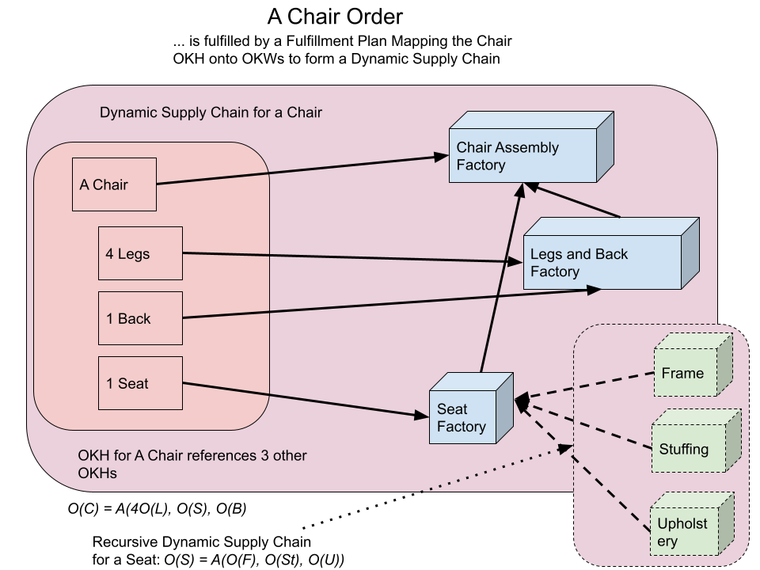
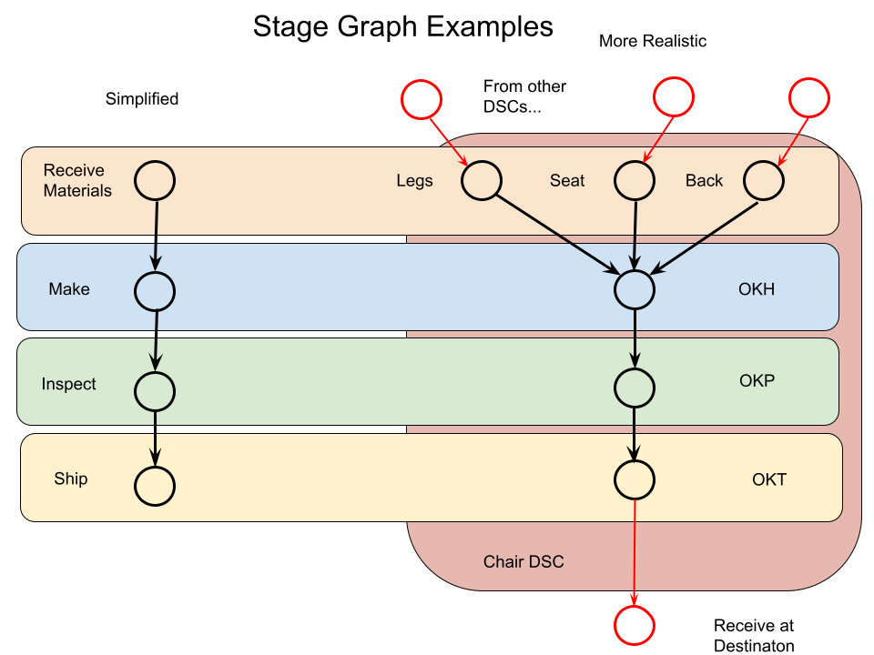
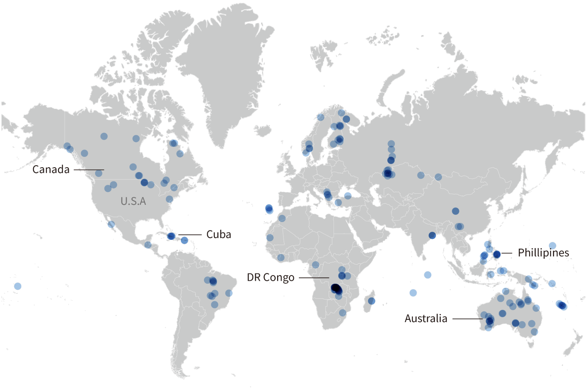
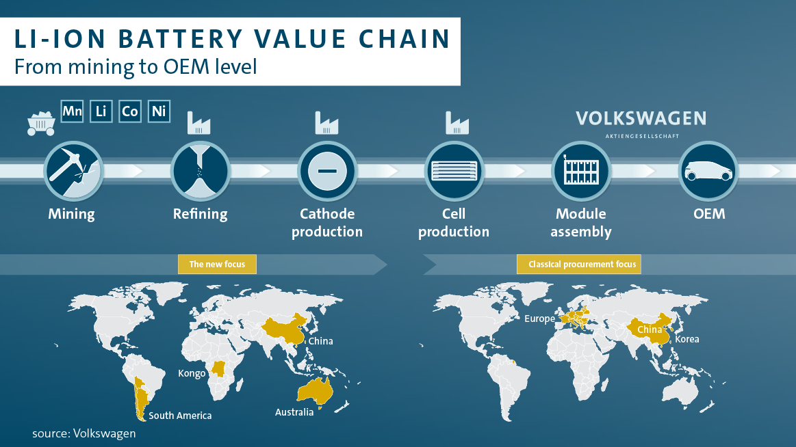

<body class="c30 c42 doc-content"><h1 class="c43" id="h.np8vhy883ebx">A Preliminary Mathematical Description of SCIS</h1>
&ndash;by Robert L. Read and Sarah Abowitz

Let a supply chain network (SN) be a collection of people, places, inventory, designs and firms that are generally expressible in the OKF. For example, in response to a hurricane, a single city might create a supply chain network consisting of 5 microfactories, a large supply of raw materials, 25 skilled makers, and 10 trucks owned by the city. Mathematically, one can consider a supply chain network to consist of a set of material suppliers {MS1, ... , MSm}, a set of OKHs {OKH1, ... , OKHn}, a set of OKWs {OKW1, &hellip; , OKWo}, and a set of OKTs {OKT1, &hellip; , OKTp}.

Let a catalog (C) be a set of objects which can potentially be ordered. An important use case of this type is objects for which an OKH is available, although there may be other objects orderable. In general call objects which can be purchased without an OKH normal&nbsp;and those that require an OKH adaptive. This language is meant to express that the Open Knowledge Framework allows adaptation to and extension of a normal supply chain network when that normal supply chain network is disrupted or completely inoperable.

Let an order (O)&nbsp;be both a collection of items chosen from a catalog and a relation mapping said collection to to quantities to be delivered of each item. (Alternatively, an order is a bag or multiset from the catalog.)

Let a fulfillment plan&nbsp;(FP) be a document that maps an order into a supply network&rsquo;s resources and connections between those resources that potentially can fulfill the order. If a supply network changes, it may invalidate a fulfillment plan that depends on said supply chain network. In general, a fulfillment plan references a supplier, an OKH, an OKW, and an OKT. Some fulfillment plans may be degenerate (for example, if a part is consumed in the same place that it is produced, it does not require an OKT.) (Note: Other elements of the Open Knowledge framework, such as OKM, may be referenced by the OKH and thus included by reference or transclusion, but are not directly part of the FP.)

A fulfillment plan is composed of a set of stages. In general these stages depend on the OKH that it mentions. Stages are either incomplete&nbsp;or complete. Each stage is something verifiable as complete by a human being, and may be annotated with documentation of a human assertion. Annotations of this kind should be sufficient to find the human agent that made the assertion of completeness. This level of documentation does not exist to assign blame or responsibility, but to take corrective action if the fulfillment plan is broken or if the assertion is later found to be inaccurate. The stages for a given object may be created from the OKH, or maybe generically created by the platform.

In general, a fulfillment plan moves from a state of unfulfillment to being fulfilled by means of stages being completed. Stages are related by a partial order relation, and when two stages are related in this way, we say one stage depends on another. Generally if stage y&nbsp;depends on stage x, it would be unusual for y&nbsp;to be complete and x&nbsp;to be incomplete, although there is nothing preventing a human from asserting that y&nbsp;is complete. This partial order creates a directed acyclic graph of stages called a stage graph. The ability to visually render this graph and its state of completeness is a useful feature of the platform.

A stage graph is a convenient object against which to perform a risk analysis. This may be considered a form of abstract interpretation as the term is used in programming language theory. For example, each stage could be annotated with a probability of (independent) failure at that node. The conditional probability of the fulfillment failing may then be computed directly from the independent probabilities of specific atomic failures. Because the probabilities of a stage failing may be highly time dependent, we can easily imagine different risk analyses based on different times.

A triple consisting of an order, fulfillment plan, and supply chain network (o, fp, sn)&nbsp;is a fundamental object supported by our platform. We may assume that an order, a supply network, and a fulfillment plan are implied by a dynamic supply chain and informally refer to this triple as a dynamic supply chain (D).

Let a platform sbe a semi-automated software system which, with the aid of humans, allows dynamic supply chains to be constructed and manipulated for the purpose of filling orders which actually deliver needed goods to people, even in the presence of supply chain disruptions. In actual practice, a supply chain network will be supporting a large number of dynamic supply chains at any one point in time.

A dynamic supply chain D&nbsp;is a mutable object which evolves over time, particularly as stages are completed. Dynamic supply chains may be indefinite, capturing the notion of continuous supply of some item across time, or definite in time, capturing the notion of an order being fulfilled and now closed. In order to understand the change of a dynamic supply chain over time, a dynamic supply chain has a history, which may be thought of as a function of the supply chain and time t which expresses the changes in a supply chain over time, which may be represented (H(D,t)). &nbsp;A dynamic supply chain which utilizes an element of an OKF is called adaptive. A dynamic supply chain which does not utilize the OKF is called normal.

Dynamic supply chains have the fundamental property of being recursively composable, as expressed in an example below where a dynamic supply chain for a chair is a composition of the dynamic supply chains for a back, a seat, and four legs. This composability fundamentally occurs at the stage we might call &ldquo;delivery&rdquo;. That is, if a part fundamentally relies on other parts, the delivery of those other parts may be considered an independent dynamic supply chain which is referenceable. Therefore, the dynamic supply chain for a chair may include by reference the dynamic supply chain for the seat. Although we may look at dynamic supply chains at different scales, for different purposes, we generally focus on the top-level dynamic supply chain which provides something useful to an end consumer.

A contract&nbsp;specifies a buyer and a dynamic supply chain. A contract may be potential, agreed upon/signed, contested&nbsp;or completed. We make no attempt to formalize the terms of the contract. Although contracts are very necessary for human cooperation, automating them is not necessarily to create a platform which provides useful supply chain interoperability.

In this sense, a dynamic supply chain is the fundamental data object that our platform and Open Knowledge Framework treats. &nbsp;Our proposed platform supports a number of functions listed below. It must be understood that at first, many of these functions are implemented with the assistance of real human beings solving real problems and making human judgements. Nonetheless, this is an organizing framework which should make supply chains more resilient. The framework may evolve through greater automation over time.

If we think of the platform as a computer program, it is similar to a database management system storing objects that are related to dynamic supply chains. However, it must provide some fundamental computational operations as well, and alongside those, some definitions of their set theory equivalents:
<ul class="c16 lst-kix_a4mjknnh0bzw-0 start"><li class="c1 c5 li-bullet-0">Compute the catalog of objects which can potentially be ordered. Ideally, this catalog would distinguish between those that clearly cannot be ordered at present due to a supply chain disruption, and those which can. However, as this may be computationally difficult, we imagine the catalog being presented along with guidance which is not guaranteed to be complete.</li></ul><ul class="c16 lst-kix_a4mjknnh0bzw-1 start"><li class="c1 c6 li-bullet-0">The set theory expression of this operation is FO : (C, SN)&nbsp;&#10236; C1&nbsp;.</li><li class="c1 c6 li-bullet-0">For every item in catalog C, FOrder recursively checks against each element of the item that supply chain network SN can reliably supply or make. If an item passes, it is cloned into C1, the catalog subset of all orderable catalog items in that catalog C which is returned to the user.</li></ul><ul class="c16 lst-kix_a4mjknnh0bzw-0"><li class="c1 c5 li-bullet-0">If the user initiates an order, the platform assists in the construction of a dynamic supply chain. Ideally, all possible dynamic supply chains which fulfill the order could be created, and the user presented a list of options, much as a website presents many different flights which all reach a destination in an approximately timely manner.</li></ul><ul class="c16 lst-kix_a4mjknnh0bzw-1 start"><li class="c1 c6 li-bullet-0">The set theory expression of this operation is W : (O, SN) &#10236; {D1(O, SN, FP1), &hellip;, Di(O, SN, FPi)} .</li><li class="c1 c6 li-bullet-0">For every item in O, Weave, abbreviated here as W, generates all possible fulfillment plans FP1, &hellip; , FPm &nbsp;and then find every unique combination (not permutation) of fulfillment plans chosen for each object, of which there should be n. Note that in this we consider two or more fulfillment plans capable of merging into a larger one. Also, fulfillment plan generation proceeds differently based on whether an item in O is normal&nbsp;or adaptive. Every normal&nbsp;item in O should have a subset of fulfillment plans based on the subset of elemental suppliers referenced by the SN that can supply that item. Meanwhile, every adaptive&nbsp;item in O should, for each component COMPONENT&nbsp;not directly provided in toto by an elemental supplier, recursively return the cross product of each W(COMPONENT, SN).&#8203;&#8203; Finally, for each fulfillment plan combination i, yield a dynamic supply chain Di(O, SN, FPi), and return all dynamic supply chains as a set. In an edge case scenario where the buyer has somehow ordered an item currently unorderable due to platform errors, this map will return the null set.</li></ul><ul class="c16 lst-kix_a4mjknnh0bzw-0"><li class="c1 c5 li-bullet-0">Track new assertions: given a new human assertion about a node in a stage graph GD, update the stage graph appropriately.</li><li class="c1 c5 li-bullet-0">Track dynamic supply chains as they evolve from uninitiated orders to fulfilled and finished orders. This is primarily tracking the human-assertion of the completion of stages.</li></ul><ul class="c16 lst-kix_1qcw722c12as-0 start"><li class="c1 c5 li-bullet-0">Assisting in the construction of a dynamic supply chain to fulfill an order from a supply network by computing from the OKH necessary subcomponents and materials.</li><li class="c1 c5 li-bullet-0">Checking the executability of a dynamic supply chain by recursively checking the executability of each component in the current supply network.</li><li class="c1 c5 li-bullet-0">Providing a framework for execution of agreement/contracts of a dynamic supply chain.</li><li class="c1 c5 li-bullet-0">Tracking the status of an order.</li><li class="c1 c5 li-bullet-0">When a dynamic supply chain fails for some reason, providing a way of organizing a human response to this failure by denoting the place of the failure and offering corrective measures.</li><li class="c1 c5 li-bullet-0">Represent when the supply chain network changes, for example when a making facility is taken off line, and correctly represent changes to the dynamic supply chains that are affected by this change. The platform is not expected to repair these dynamic supply chains automatically.</li></ul><h2 class="c34" id="h.xvcvbdo8gbzz">Operations</h2>

[A note from Rob: I&rsquo;ve now read over this once and understand it. The big question in my mind now is if we should continue working at this level (a math-y level) or if we should work at a class-y level in Python. I&rsquo;m going to try to understand Sage Math in Python a bit more before I make this decision. The work below is a good start. As a &ldquo;theory&rdquo; (in this sense of a collection of theorems, not in the sense of a question to be answered) it is weak because it presents no theorems. I also believe the symbol F is a big over used. Also I prefer not to use color because it is not supported by LaTeX and standard mathematical practice (I would prefer to use subscripts and different fonts to accomplish the intended distinctions.)]

[BIGGER NOTE from Rob: This work of Sarah&rsquo;s was influential in the Python code that I wrote. However, the Python code now somewhat supersedes it by being more concrete. However, we now need to go BACK from the Python and into a Math-like notation as Sarah has used here. This will not be particularly difficult, and will cut down overall space here, but there is really no other way for us to proceed.]
<ol class="c16 lst-kix_2u9sey4a7ozs-0 start" start="1"><li class="c5 c17 li-bullet-0"><h3 id="h.du8nyiv7d6ee" style="display:inline">Plan</h3></li></ol><ol class="c16 lst-kix_2u9sey4a7ozs-1 start" start="1"><li class="c1 c6 li-bullet-0">P: (T,OKH,F) &nbsp;&#10236; S &nbsp;Let P&nbsp;be a function that takes an OKH and the set fulfillment plans for each input I and produced a Stage Graph in an initial, empty state (with no suppliers decorating it.) The resulting stage graph may be a one-node stage graph if the OKH is null. The output good is of type T. The input Fulfillment plans be from simple suppliers.</li><li class="c1 c6 li-bullet-0">From an OKH, P always produces a simple 2-level plan, though the leaves of that plan may be plans themselves. The height of the plan produced by P is 1+ the height of the highest set in F.</li></ol><ol class="c16 lst-kix_2u9sey4a7ozs-0" start="2"><li class="c1 c5 li-bullet-0">Characteristic Equation</li></ol><ol class="c16 lst-kix_2u9sey4a7ozs-1 start" start="1"><li class="c1 c6 li-bullet-0">Ceq&nbsp;: (S) &nbsp;&#10236; E &nbsp;Let Ceq&nbsp;be a function on a stage graph that generates the characteristic pricing equation of the inputs. Ceq(P(OKH)) is thus a characteristic pricing equation.</li></ol><ol class="c16 lst-kix_2u9sey4a7ozs-0" start="3"><li class="c17 c41 li-bullet-1"><h3 id="h.de4i90r424rl" style="display:inline">Weave <a class="c40" href="mailto:read.robert@gmail.com">read.robert@gmail.com</a>&nbsp;Thoughts on Weave</h3></li></ol><ol class="c16 lst-kix_2u9sey4a7ozs-1 start" start="1"><li class="c1 c6 li-bullet-0">W&nbsp;: (DT,SN) &nbsp;&#10236; {F} Let W&nbsp;be a function that takes a single demand DT for a good of type T and produces a set of fulfillment plans, each of which produces the good of type T. For example, if there are 3 suppliers of type T and 2 OKHs in the supply network SN for type T, W(DT,SN) will produce a set of 5 distinct fulfillment plans.</li><li class="c1 c6 li-bullet-0">W(DT,SN):</li></ol>
For each S in SN:

&nbsp;&nbsp;&nbsp;&nbsp;&nbsp;&nbsp;&nbsp;&nbsp;If Type(S) == T: 

&nbsp;&nbsp;&nbsp;&nbsp;&nbsp;&nbsp;&nbsp;&nbsp;&nbsp;&nbsp;&nbsp;&nbsp;&nbsp;&nbsp;&nbsp;&nbsp;If IsAnOKH(S):

&nbsp;&nbsp;&nbsp;&nbsp;&nbsp;&nbsp;&nbsp;&nbsp;&nbsp;&nbsp;&nbsp;&nbsp;&nbsp;&nbsp;&nbsp;&nbsp;&nbsp;&nbsp;&nbsp;&nbsp;&nbsp;&nbsp;&nbsp;&nbsp;K = the OKH for S

&nbsp;&nbsp;&nbsp;&nbsp;&nbsp;&nbsp;&nbsp;&nbsp;&nbsp;&nbsp;&nbsp;&nbsp;&nbsp;&nbsp;&nbsp;&nbsp;&nbsp;&nbsp;&nbsp;&nbsp;&nbsp;&nbsp;&nbsp;&nbsp;G = {}

&nbsp;&nbsp;&nbsp;&nbsp;&nbsp;&nbsp;&nbsp;&nbsp;&nbsp;&nbsp;&nbsp;&nbsp;&nbsp;&nbsp;&nbsp;&nbsp;&nbsp;&nbsp;&nbsp;&nbsp;&nbsp;&nbsp;&nbsp;&nbsp;For each input I in K:

&nbsp;&nbsp;&nbsp;&nbsp;&nbsp;&nbsp;&nbsp;&nbsp;&nbsp;&nbsp;&nbsp;&nbsp;&nbsp;&nbsp;&nbsp;&nbsp;&nbsp;&nbsp;&nbsp;&nbsp;&nbsp;&nbsp;&nbsp;&nbsp;&nbsp;&nbsp;&nbsp;&nbsp;&nbsp;&nbsp;&nbsp;&nbsp;G &#8899;= {W(I,SN)}

&nbsp;&nbsp;&nbsp;&nbsp;&nbsp;&nbsp;&nbsp;&nbsp;&nbsp;&nbsp;&nbsp;&nbsp;&nbsp;&nbsp;&nbsp;&nbsp;&nbsp;&nbsp;&nbsp;&nbsp;&nbsp;&nbsp;&nbsp;&nbsp;F &#8899;= P(T,K,G)

&nbsp;&nbsp;&nbsp;&nbsp;&nbsp;&nbsp;&nbsp;&nbsp;&nbsp;&nbsp;&nbsp;&nbsp;&nbsp;&nbsp;&nbsp;&nbsp;Else:

&nbsp;&nbsp;&nbsp;&nbsp;&nbsp;&nbsp;&nbsp;&nbsp;&nbsp;&nbsp;&nbsp;&nbsp;&nbsp;&nbsp;&nbsp;&nbsp;&nbsp;&nbsp;&nbsp;&nbsp;&nbsp;&nbsp;&nbsp;&nbsp;F &#8899;= P(T,null,S)

return F
<ol class="c16 lst-kix_2u9sey4a7ozs-0" start="4"><li class="c17 c5 li-bullet-0"><h3 id="h.9yw3miw6mdm7" style="display:inline">Weave &nbsp;<a class="c40" href="mailto:charmingquark16@gmail.com">charmingquark16@gmail.com</a>Thoughts on Weave</h3></li></ol><ol class="c16 lst-kix_2u9sey4a7ozs-1 start" start="1"><li class="c1 c6 li-bullet-0">Primary Definition</li></ol><ol class="c16 lst-kix_2u9sey4a7ozs-2 start" start="1"><li class="c1 c25 li-bullet-0">W(O, SN) &#10236; {D1(O, SN, FP1), &hellip;, Di(O, SN, FPi)}</li><li class="c1 c25 li-bullet-0">For every item in an order O,&nbsp;Weave, abbreviated here as W, generates all possible fulfillment plans FP1, &hellip; , FPm &nbsp;across the given supply network SN&nbsp;and then find every unique combination (not permutation) of fulfillment plans chosen for each item, of which there should be n. The set of unique combinations of fulfillment plans for each item will be referred to as a cross product. Note that in this we consider two or more fulfillment plans capable of merging into a larger one. Also, fulfillment plan generation proceeds differently based on whether an item in O&nbsp;is normal&nbsp;or adaptive. Every normal&nbsp;item in O&nbsp;should have a cross product of fulfillment plans based on the subset of elemental suppliers referenced by the SN&nbsp;that can supply that item. Meanwhile, every adaptive&nbsp;item in O&nbsp;should, for each component&nbsp;COMPONENT&nbsp;not directly provided in toto by an elemental supplier, recursively return the cross product of each W(COMPONENT, SN).&#8203;&#8203; Finally, for each fulfillment plan combination i, yield a dynamic supply chain Di(O, SN, FPi), and return all dynamic supply chains as a set. In an edge case scenario where the buyer has somehow ordered an item currently unorderable due to platform errors, this map will return the null set.</li></ol><ol class="c16 lst-kix_2u9sey4a7ozs-1" start="2"><li class="c1 c6 li-bullet-0">Other Uses</li></ol><ol class="c16 lst-kix_2u9sey4a7ozs-2 start" start="1"><li class="c1 c25 li-bullet-0">W(D0.O, SNNew) &#10236; D1(D0.O, SNNew, FP1), &hellip;, Di(D0.O, SNNew, FPi)</li><li class="c1 c25 li-bullet-0">The Weave&nbsp;function can also handle reweaving dynamic supply chains given an updated supply chain network and given that one can access elements of a dynamic supply chain D0&nbsp;from inside it. Rather than taking in a triple to initiate multiple dynamic supply chains, we will take the currently flawed dynamic supply chain D0&nbsp;we already have and access its order O, and together with the updated supply chain network SNNew, Weave&nbsp;yet again assembles a series of possible dynamic supply chains. In this example, we assume that through human assertion we have already updated the supply chain network so that the change has been recorded in the platform, but it is still necessary to run Weave so that the current fulfillment plan and the dynamic supply chain reflect order state properly.</li></ol><ol class="c16 lst-kix_2u9sey4a7ozs-0" start="5"><li class="c17 c5 li-bullet-0"><h3 id="h.tn4sk9ly14yr" style="display:inline">Order&nbsp;&nbsp;&nbsp;&nbsp;&nbsp;&nbsp;&nbsp;&nbsp;</h3></li></ol><ol class="c16 lst-kix_2u9sey4a7ozs-1 start" start="1"><li class="c1 c6 li-bullet-0">FO : (C, SN)&nbsp;&#10236; C1&nbsp;</li><li class="c1 c6 li-bullet-0">For every item in catalog C, FOrder recursively checks against each element of the item that supply chain network SN&nbsp;can reliably supply or make. If an item passes, it is cloned into C1, the catalog subset of all orderable catalog items in that catalog C&nbsp;which is returned to the user.</li><li class="c1 c6 li-bullet-0">Note: A colleague I consulted for some early feedback on this said this action is essentially NP-complete.&nbsp;&nbsp;&nbsp;&nbsp;&nbsp;&nbsp;&nbsp;&nbsp;</li></ol><ol class="c16 lst-kix_2u9sey4a7ozs-0" start="6"><li class="c17 c5 li-bullet-0"><h3 id="h.77mr8mkyaddm" style="display:inline">Update</h3></li></ol><ol class="c16 lst-kix_2u9sey4a7ozs-1 start" start="1"><li class="c1 c6 li-bullet-0">U(H, GD)&nbsp;&#10236; GD&rsquo;</li><li class="c1 c6 li-bullet-0">Given an old stage graph GD&nbsp;and a new human assertion H&nbsp;(e.g. &ldquo;mask assembly factory suddenly offline&rdquo;), Update&nbsp;reads in H&nbsp;and uses that to update the previous stage graph into a more current version of itself, which we call GD&rsquo;. Individual interpretation of what exactly constitutes a human assertion on a platform may vary between platform providers, but one expectation of minimal criteria for this is a human-readable description of the assertion, a reference to a node on GD, &nbsp;and a state to apply to it. Perhaps one day support for subgraph state updates could exist in Update.</li></ol><ol class="c16 lst-kix_2u9sey4a7ozs-0" start="7"><li class="c17 c5 li-bullet-0"><h3 id="h.y3t803lduvn1" style="display:inline">Query</h3></li></ol><ol class="c16 lst-kix_2u9sey4a7ozs-1 start" start="1"><li class="c1 c6 li-bullet-0">FQ(GD)&nbsp;&#10236; s</li><li class="c1 c6 li-bullet-0">FQ&nbsp;traverses each stage graph represented in dynamic supply chain&nbsp;D&nbsp;and yields a percentage score s&nbsp;of how many stages are marked complete by human assertion on the platform. (we could do percentages better shrug)</li></ol><ol class="c16 lst-kix_2u9sey4a7ozs-0" start="8"><li class="c17 c5 li-bullet-0"><h3 id="h.a3eblnj1pro" style="display:inline">Inspect</h3></li></ol><ol class="c16 lst-kix_2u9sey4a7ozs-1 start" start="1"><li class="c1 c6 li-bullet-0">I(OKH)&nbsp;&#10236; GOKH</li><li class="c1 c6 li-bullet-0">Inspect&nbsp;determines each material listed in its given OKH&nbsp;and adds a material node requirement to its root level stage graph. If it finds a subcomponent OKHj&nbsp;listed as an ingredient of the given OKH, &nbsp;I&nbsp;recursively calls itself with OKHj&nbsp;until all subcomponents, subsubcomponents, etc of OKHj are resolved and presented into a stage graph of OKHj&nbsp;with OKHj&nbsp;as head and materials as leaves. Once each subcomponent OKHj&nbsp;has been rendered so, it is then possible to render and return result GOKH&nbsp;for possible SN comparison.</li></ol><ol class="c16 lst-kix_2u9sey4a7ozs-0" start="9"><li class="c17 c5 li-bullet-0"><h3 id="h.zhf9dzcc1lja" style="display:inline">Assess</h3></li></ol><ol class="c16 lst-kix_2u9sey4a7ozs-1 start" start="1"><li class="c1 c6 li-bullet-0">FA(SN, GD)&nbsp;&#10236; LD</li><li class="c1 c6 li-bullet-0">While I love the idea of bottom-up verification, if Inspect&nbsp;is used to assemble a complete stage graph GD&nbsp;for a dynamic supply chain D, all FAssess&nbsp;has to do to check executability here is compare leaves against SN&nbsp;in the same way FOrder&nbsp;does, and return leaf results as a set. Alternatively, this process could recurse while a version of FError&nbsp;tuned to find gaps in SN&lsquo;s coverage returns a list of breakpoints in D&rsquo;s&nbsp;executability. </li></ol><ol class="c16 lst-kix_2u9sey4a7ozs-0" start="10"><li class="c17 c5 li-bullet-0"><h3 id="h.uc24knc3b1ru" style="display:inline">Validate</h3></li></ol><ol class="c16 lst-kix_2u9sey4a7ozs-1 start" start="1"><li class="c1 c6 li-bullet-0">FV(A, O, SN, FP)&nbsp;&#10236; D(O, SN, FP) </li><li class="c1 c6 li-bullet-0">Disclaimer: there are many ways to express this, and while I&rsquo;ve chosen to express the various things we look at in the contract these all share as individual inputs, we could easily rewrite this as FV(C), or denote a common origin ala FV(AC, OC, SNC, FPC). </li><li class="c1 c6 li-bullet-0">In this mapping relation, we&rsquo;re assuming that presented with an order O, a supply chain network SN, a fulfillment plan FP, and an agreement state A, if FV&nbsp;succeeds, it will return one valid dynamic supply chain. Here are the steps of how this happens: FV&nbsp;is called while it has a contract it can work with, and while it is clear to the platform that said contract is considerably close to entering production. O, SN,&nbsp;and FP&nbsp;are specified in a contract C, and A&nbsp;is a variable representing the current status of agreement amongst all parties in C. Anyway, first FV &nbsp;checks that A&nbsp;represents the agreement quota needed to move into production. If this is indeed true, FV attempts to assemble a valid dynamic supply chain D from the variables O, SN,&nbsp;and FP&nbsp;as specified in C, and if it succeeds in such a way that O&nbsp;and FP&nbsp;are still viable on a defined supply chain network SN, then D is initiated and returned.</li><li class="c1 c6 li-bullet-0">Note: There are likely several ways to represent A&nbsp;on platforms within these rules, but I (Sarah) am unsure if we want to get into that.</li></ol><ol class="c16 lst-kix_2u9sey4a7ozs-0" start="11"><li class="c17 c5 li-bullet-0"><h3 id="h.qf29iuwp0s5e" style="display:inline">Error</h3></li></ol><ol class="c16 lst-kix_2u9sey4a7ozs-1 start" start="1"><li class="c1 c6 li-bullet-0">FE(GD)&nbsp;&#10236; N1, &hellip;, Nm&nbsp;</li><li class="c1 c6 li-bullet-0">This function exists to find root causes of failure in a failed supply chain stage graph GD. &nbsp;FError&nbsp;accomplishes this by recursively tracking all failed nodes with no failed children in the dynamic supply chain stage graph GD&nbsp;and adds them to the set of failure leaves N1, &hellip;, Nm&nbsp;. Such a function can precede Weave in a way so that the output of FError&nbsp;when used to initialize a custom order can be run with Weave over a supply network to generate all possible dynamic supply chains that can possibly yield the correct versions of ingredients needed in the dynamic supply chain to complete the order. Depending on how much one wants to rely on human assertion, there could be a third step comparing the results against the failed fulfillment plan and removing any plans that match the erroneous fulfillment plan enough to replicate those same failures.</li></ol><ol class="c16 lst-kix_2u9sey4a7ozs-0" start="12"><li class="c17 c5 li-bullet-0"><h3 id="h.ek6vg0ou8t5i" style="display:inline">Substitution</h3></li></ol><ol class="c16 lst-kix_2u9sey4a7ozs-1 start" start="1"><li class="c1 c6 li-bullet-0">Concept for substitution goes here </li><li class="c1 c6 li-bullet-0">What is equal? &nbsp;</li></ol><ol class="c16 lst-kix_2u9sey4a7ozs-2 start" start="1"><li class="c1 c25 li-bullet-0">Isomorphic in a Quality Measure Space. Two products are equal if all relevant &lsquo;qualities&rsquo;&nbsp;of the product are quantitatively within the acceptable deviation from the average value for that quality.</li><li class="c1 c25 li-bullet-0">Qualities are hierarchically organized, and the hierarchy must have emergent functions at the top, since many highly different low level configurations can produce the same outcome (a human + abacus is &ldquo;equal&rdquo; to an automated spreadsheet, for some purposes. Only when the error rate must reach machinic lows, or the timeframe reach speeds only possible in digital computers, and many other such circumstances that push us outside the bounds of the qualitative measure space, are the systems unequal in function.)</li><li class="c1 c25 li-bullet-0">Two systems function equally well if their functions are performed equally well by different configurations of hardware and software, such that the END PRODUCT satisfies all the conditions of the user.</li></ol><ol class="c16 lst-kix_2u9sey4a7ozs-1" start="3"><li class="c1 c6 li-bullet-0">A fundamental theorem: Substitution executed over the Error results relative to a SupplyNetwork finds a functional supplyChain if their is one. This could be formulated: it gives the same result that Weave gives from an undisrupted ne</li></ol><h3 class="c17 c45" id="h.42uyfp1eo9qa"></h3>
[Note: Rob is adding this section to record a thought that may be important; it is not yet unified with Sarah&rsquo;s work above.]
<h2 class="c34" id="h.fyyyo66gw88l">The Fundamental OKF-based Operation</h2>
In practice, the OKF augments rather than replaces existing supply networks. If we consider how an OKF-augmented supply network differs from a standard supply network, it seems that the fundamental action in an acute crisis is likely to be different:
<ol class="c16 lst-kix_hts3vcx987qb-0 start" start="1"><li class="c1 c5 li-bullet-0">Because OKF suppliers are new and probably untrusted, we expect more communication and more negotiation.</li><li class="c1 c5 li-bullet-0">Because OKF suppliers may not be able to produce their own supply network of fundamental inputs to an OKH they can produce, deciding how to obtain those fundamental inputs becomes a computational problem that someone must solve.</li><li class="c1 c5 li-bullet-0">Because the OKF is expected to be of greater value in an acute crisis, we expect the computation of price to depend on the price of inputs, and the OKH-impelmentor may have no more knowledge of these prices than the Buyer.</li></ol>
Therefore, a fundamental operation is to produce a &ldquo;negotiation frame&rdquo; based on an OKH. The frame contains the contact information of all parties that most participate in the OKH: the maker, the suppliers of the inputs, and the buyer. This frame can then be used by either the maker or the buyer to understand prices and negotiate actual contracts allowing the delivery of the good to the buyer.

For example, suppose there is no supply of ready-made chairs, but an OKH for a chair exists. The fundamental inputs (at the first level of recursion only) to a chair are 1 seat, 1 back, and 4 legs. &nbsp;Let us assume that the supply network can provide seats, backs, and legs. The fundamental things a person who needs chairs wants to know are:
<ol class="c16 lst-kix_kepipaxjhzha-0 start" start="1"><li class="c1 c5 li-bullet-0">Who do I talk to to order a chair?</li><li class="c1 c5 li-bullet-0">Who do I talk to to order the inputs?</li><li class="c1 c5 li-bullet-0">Although the price may not be known and may be negotiable, what is the price structure?</li></ol>
In turns out the price of a chair can be understood as an equation:

P = 4 * L + 1 * B + 1 * S + K = K + 4L + B + S,

where L is the price of a leg, B is the price of a back, S is the price of a seat, and K is a constant representing the price of the labor of assembly. &nbsp;Let&rsquo;s name such equations the &ldquo;characteristic pricing equation&rdquo; of the fulfillment plan. Although all of these may be negotiable, the platform can give contact information for all of the people who can determine these prices with negotiation. So providing that info and the equation above is a fundamental operation. The Weave function does not technically have to produce the characteristic pricing equation because they can be computed from a fulfillment plan.

If more than one OKH is required (for example, nobody is supplying Legs but instructions for woodturning maple boards into legs are available), then naturally this becomes recursive. That is, an OKH may need an OKH to get a fundamental input. The characteristic pricing equation can be updated by simple algebraic substitution.

There is some opportunity for tiny amounts of linear algebra in this. If we think of the price of all basic inputs (fundamental inputs not created by OKHs) as a vertical vector P of length N and the number of distinct goods purchased in an order by M, then we can compose the characteristic equations into an M-row, N-column matrix Q. The price of the order is a vertical vector of length M defined by the matrix multiplication of Q x P. &nbsp;(The total price is the L1-norm or simple sum of P.) 

Although elegant, this has limited utility, because in general Weave should produce multiple plans for obtaining a given good. Until a plan is chosen, the matrix approach cannot be used by simple multiplication (it can still form a useful &ldquo;table&rdquo; however.) However, if one sets aside the multiple plan problem, then one can even form a &ldquo;Price Jacobian&rdquo; as a matrix which gives the change in price of the final good as a function of the change in price of the input fundamental commodities. This could be used to compute the points in which two plans for the same good have equal total prices based on commodity prices.
<h3 class="c17 c19" id="h.cahnffcxv8fy">On Agent-based Pricing</h3>
In general, prices will be set by the actions of (human) agents who are both buying and selling. This is especially true in a disrupted supply network, when the fundamental assumption of perfect market knowledge is unlikely to hold. Therefore any discussion of pricing will be somewhat academic. Nevertheless the characteristic pricing equations remain useful as an incontrovertible minimum price.
<h3 class="c17 c19" id="h.qahb0035u5mo">On Continuous vs. Discrete Pricing</h3>
One of the advantages of the characteristic pricing equation is that it delays making a decision if prices are treated as continuous or discrete. For example, many firms wish to establish a supply chain that constantly, continuously, and smoothly delivers goods. In such a situation demand and supply need not be measured in absolute units but as rates---units per unit time. For example, ventilators per day. A given firm may only be able to make 2.7 ventilators per day. The fact that a fraction of a ventilator is nonsense is irrelevant so long as the orders are large and long-duration.

Discrete pricing, on the other hand, imagines the fulfillment plan as executing a single operation and then stopping.

Note: Our current OKF probably does not assign unique enough identifiers of the &ldquo;type&rdquo; of the good. This is the domain of so-called ontologies. This problem is neither completely solvable, nor particularly problematic---we can survive doing this by hand in many cases.

<h2 class="c34" id="h.ansohdhb2a5v">On Recursive Dynamic Supply Chains</h2>

Dynamic supply chains have the properties of composability and recursive definition. The OKF supports this, though not without some human interaction. For example, to make a chair, you may need legs, a seat, and a back. Let us suppose that a given microfactory allows the construction of a dynamic supply chain (L). For the time being, assume this is elementary&ndash;that we need not consider what goes into making legs, but can trust that our supply chain network provides a factory that can make legs. An order O(L) can create a dynamic supply chain that delivers legs.

Likewise, if we can make a seat (S) and a back (B), we can compose instances of these three objects to make a chair (C). An oversimplification in terms of objects which may be chosen from the catalog of the OKF is: C&nbsp;= 4L&nbsp;&amp; S&nbsp;&amp; B.

Figure 4. A diagram of the recursive dynamic supply chain for a chair, which also contains a recursive dynamic supply chain for a seat. &nbsp;

In actuality, a dynamic supply chain which fulfills legs can be composed with dynamic supply chains for a seat and back to create a dynamic supply chain for a chair. An order for a chair can be fulfilled against this dynamic supply chain.

Of course, a chair is not just a box containing four legs, a seat and a back. These objects must be fitted together and assembled, and this operation can fail. Technically, we would say:

O(C) = A(4O(L), O(S), O(B))

where A&nbsp;is a function of assembly coming specifically from an OKH template.

This structure is a tree of depth 1. In actual practice, a dynamic supply chain would likely be deeper. However, we can generally compose dynamic supply chains in tree-like fashion of expanding depth. &nbsp;The function A&nbsp;is not quite so simple as a pure union of subsets, but we can usefully pretend this is so to organize a dynamic supply chain. 

When we discuss the completeness of dynamic supply chains below, we mention the concept of a property such as being free of the allergen latex. We can define a boolean function F operating on dynamic supply chains that represents allergen-freedom, which can literally be defined recursively: 

F(P)&nbsp;= human assertion, when P&nbsp;is an elemental part

F(A(P1,P2,...PN)) = F(A) &amp;&amp; F(P1) &amp;&amp; F(P2) &hellip; F(PN)

Like completeness, allergy freedom is a computable function against fulfillment plans. 
<h2 class="c34" id="h.23x9bt8p8x2t">Example of Stage Graphs</h2>
Consider what the stage graph of the dynamic supply chain for the chair might look like, as shown in the figure below. A very simplified graph might have four stages: Receive Materials, Make, Inspect, and Ship. However, a platform that is expected to be useful, particularly in the presence of widespread disruptions and chaos, should provide richer tracking, as shown on the right of the figure. This diagram also suggests the composition of the dynamic supply chains.

<h2 class="c34" id="h.vs8bdmb5y2pd">On Modularity</h2>
One aspect of modularity boils down to this: When is it acceptable to replace a part P&nbsp;with a similar part P1? &nbsp;For example, for a given order for a chair O(C) using a back B, how do we know a similar design for a back B1&nbsp;is an acceptable replacement? A supply network which allows this substitution is generally more resilient than one which does not. Even if it requires human judgment, a recursive structure is more comprehensible when explaining such modularity to others.

For example, let us suppose that a buyer has used the platform to generate a dynamic supply chain for a chair and the order has been placed. The platform formally tracks this status of O(C) = A(4O(L) &#8899; O(S) &#8899; &nbsp;O(B)) as &ldquo;placed&rdquo;. The order is a witness to the agreement of the parties to build and deliver a chair.

Now, suppose there is a supply network rupture, and the manufacturer of seats cannot fulfill their part of the order. However, there is a seat S1&nbsp;in the catalog. We do not imagine that S1&nbsp;can be substituted for S&nbsp;without human approval, but the order allows the means for one to ask the buyer if S1&nbsp;is an acceptable replacement to S, and for one to record said answer. The resilience of the supply network improves as more components, such as seats, are added to the OKF.
<h2 class="c34" id="h.kfsq5luxrzl0">On Mathematical Composability of Supply Chains</h2>
Let modularity&nbsp;be the replacement of one object for another. Composability&nbsp;is a more powerful concept: it is the ability to rearrange the relationships between objects. The platform supports the composability of dynamic supply chains, but not objects. For example, we might have a supply network comprising three microfactories, one making legs, one making seats, and one making backs. However, if one of these is removed from the supply network by a mishap such as a flood, we must now compose a dynamic supply chain using only two factories. Some factories will have to make more than one kind of component if we are to fulfill an order for chairs. However, this is possible and anticipated by factories that can process a wide variety of OKHs.
<h1 class="c43 c51" id="h.e76x5xxx5igl">Composability and Completeness of Orders and Dynamic Supply Chains</h1>
A interoperable dynamic supply chain&nbsp;is created when someone establishes a platform that uses the OKF. Such a dynamic supply chain can be thought of as the elements that fulfill an order. For example, one can easily imagine an OKH being created very quickly in response to an emergency which is quite specifically tailored to ensure the device is manufactured in a way that meets FDA requirements, whether those are long-standing or were created acutely through an Emergency Use Authorization. An order is complete&nbsp;when there is verifiable evidence that a dynamic supply chain can fulfill the order. Although this evidence may be automated in some cases, it will generally consist of recorded human assertions.

If we consider a general order purchasable from the catalog presented by the platform, the object will automatically have quality assurance built into the OKH, instructing how to build and verify it. However, suppose that the buyer purchases new requirements or criteria on the order, such as that it be latex-free or nickel-free, which is not already a part of the OKH. &nbsp;A human being can create evidence that the object is allergen-free by checking the OKMs of all the ingredients that comprise the object. This evidence, in combination with the rest of the OKHs&rsquo; tests, may make this order complete in the context of a dynamic supply chain which can provide all the components necessary to fulfill the order.

Checking for completeness of orders and composing orders which are complete is the primary executable function of the platform. We may expect this evidence to be generally correct, but occasionally humans make errors. In that case, the order will not be properly fulfilled; however, the failure is any understood in the context of the traceability of the error. The OKF and traceability provide all the information necessary to track the problem down and fix it. For example, the evidence that no sub-component contains nickel could have been made erroneously even though a sub-component clearly states that it contains nickel, or alternatively, a component may contain nickel while erroneously stating that it is nickel-free. There may be other failure modes, but the platform, the dynamic supply chain, and the OKF, provide means of addressing the problem. The order, although not fulfilled, still represents a useful correctable plan for its fulfillment.

Physical objects produced by the OKF are composable. Often to supply an object dynamically, a supply chain must supply several components. Each of these components may be thought of as requiring an order fulfillment against a dynamic supply chain.

A quality criterion can be recursively verifiable by being verified by each dynamic supply chain which makes a part of a product. Freedom from allergens is such an example; if all components are allergen free, the product is allergen free. In general, however, each quality criterion is not so easy to satisfy with simple evidence. Nonetheless, the OKF provides at least a framework for providing evidence of completeness. For example, suppose that two materials are heat-bonded into a mask. The platform likely has clear quality controls on each material separately, but is not expected to be able to assert that they can be heated in contact without producing a toxic byproduct. However, a human being can provide this evidence at the level of the final product (which may be only a sub-product from the buyer&rsquo;s point of view.) This framework thus provides an evidentiary record of the completeness and satisfaction of all criteria, even though this is not fully automatable and is subject to human judgment and error.

An order can be thought of as a sentence or expression in an informal language, which can be checked for completeness by checking that the platform and dynamic supply chain and assembly processes can provide a product which meets all criteria. A provably complete order is a good candidate for fulfillment. Although quality, production capability, and ability to finance the operation are all required to complete the order, it may be useful to separate these concerns. For example, an order may be complete, yet also rely on a manufacturer of a sub-component in a microfactory with no established reputation. The buyer may then hesitate because they are not convinced that every needed component can be reliably supplied by the dynamic supply chain. This unreliability is partially addressed by the fungibility of resources provided by the OKF. If an agile, dynamic supply chain is established, one manufacturer may indeed be statistically unreliable, not because of quality but simple failure to execute obligations. However, the OKF provides inherent resilience in that the unreliable party is not the only party which is capable of making the subpart, by definition. Although a failure of one supplier may delay a specific order, the order can be successfully completed by other suppliers from the OKF. Thus the OKF allows resilient, composable dynamic supply chains to be established which allow orders to be checked for completeness, and provide the ability to trace and recover from failures of the platform.
<h2 class="c34" id="h.3ksoy7ux7990">(DRAFT) Formalization of Fragility</h2>

Note: The following assumes price affects neither supply nor demand. This is appropriate for life-critical equipment in the presence of supply shortages. Equivalently, the demand and supply are both highly inelastic.

Let the symbol B represent fragility. The units of B could be human mortality or morbidity, but it is probably most convenient to use dollars as the unit. Note: The value B may be thought of as &ldquo;lost value due to fragility&rdquo;. It can exceed the total value spent on a particular product because it can measure surplus value. For example, if toilet paper is $1 before a crisis and then is in short supply and the price would naturally rise to $10/roll, the surplus value of toilet paper, even when the price is $1, is clearly $10.

Let Sp(X)&nbsp;be the maximum number of units that a group of suppliers X can provide of product p.

Let Wp(D,S)&nbsp;be a weighting function of the demand D for p and the supply of S of p. W can be any function desired producing the same units as fragility, with two conditions: W is decreasing in S, and increasing in (D-S).

Acceptable examples of W are:

Wvent&nbsp;= $50K * &nbsp;&nbsp;&nbsp;&nbsp;&nbsp;&nbsp;&nbsp;&nbsp;{ &nbsp;&nbsp;&nbsp;&nbsp;&nbsp;&nbsp;&nbsp;&nbsp;Dvent&nbsp;- Svent, &nbsp; &nbsp;&nbsp;&nbsp;&nbsp;&nbsp;&nbsp;&nbsp;&nbsp;&nbsp;&nbsp;&nbsp;&nbsp;&nbsp;&nbsp;&nbsp;&nbsp;&nbsp;if Dvent &lt; 100K; 

100,000 - Svent, &nbsp; &nbsp;&nbsp;&nbsp;&nbsp;&nbsp;&nbsp;&nbsp;&nbsp;&nbsp;&nbsp;&nbsp;&nbsp;&nbsp;&nbsp;&nbsp;&nbsp;if Dvent&nbsp;&gt;= 100K}

Wmask&nbsp;= $5 * &nbsp;&nbsp;&nbsp;&nbsp;&nbsp;&nbsp;&nbsp;&nbsp;{ &nbsp;&nbsp;&nbsp;&nbsp;&nbsp;&nbsp;&nbsp;&nbsp;0, &nbsp;&nbsp;&nbsp;&nbsp;&nbsp;&nbsp;&nbsp;&nbsp;&nbsp;&nbsp;&nbsp;&nbsp;&nbsp;&nbsp;&nbsp;&nbsp;&nbsp;&nbsp;&nbsp;&nbsp;&nbsp;&nbsp;&nbsp;&nbsp;&nbsp;&nbsp;&nbsp;&nbsp;&nbsp;&nbsp;&nbsp;&nbsp;if Smask &nbsp;&lt; Dmask;

&nbsp;&nbsp;&nbsp;&nbsp;&nbsp;&nbsp;&nbsp;&nbsp;&nbsp;(Dmask&nbsp;- Smask) / Dmask ,&nbsp;&nbsp;&nbsp;&nbsp;&nbsp;&nbsp;&nbsp;&nbsp;else}

Let Pp(d)&nbsp;be a probability density function representing the probability of a specific demand d&nbsp;for product p.

The B is the expected fragility of a set of suppliers Y is the integral over all demand products (p) over all probabilities x:

Let B&nbsp;represent the expected fragility of a set of suppliers Y. We define this by integrating over the probability distribution P&nbsp;of all possible demands (x) for all products (p).

B(Y,Pp,Wp)&nbsp;=&nbsp;&int;p&nbsp; &int;xWp(Dp,Sp(Y)) Pp(x) dp dx

We can then make some useful and logical conjectures on the nature of fragility in SCIS. 

Conjecture 1: Increasing the set of suppliers does not increase fragility. Let A&nbsp;be a set of additional suppliers to the set Y. 

B(Y &#8899; A, P, W) &lt;= B(Y, P, W)

Under suitable assumptions of W&nbsp;and P&nbsp;we can prove much stronger theorems.

Actual values of B can be computed by Monte Carlo simulation (based on probability distribution). The utility of these values will be based on the realism of the variables.

Note: (Kevin wanted me to add this language)

The purpose of your platform is to allow delivery of needed goods when all of the trust mechanisms that are normally in place have been dissolved because of an extraordinary supply chain disruption. Normally, a buyer does not need to worry about a fulfillment plan---that is handled by professional procurement officers in normal circumstances. However, during an emergency, the buyer may want and need to see an entire fulfillment plan in order to have confidence that their demand can be met.

<h2 class="c34" id="h.jq6xm8bnmsk3">Theorems and Proofs</h2>
A graph is only as resilient as the count of its separable paths. The convergence of independent paths through a supply graph is often called a bottleneck. A supply graph&rsquo;s resilience metric is reducible&nbsp;to an evaluation of its bottleneck, in units of important metrics like agility (rise time&nbsp;to meet new demand signal).

Individual paths through a supply graph may converge, or diverge from, these bottleneck points. Formally, a path is separable from another path, if they share no nodes (and consequently no edges).

Example 1: There might be 10 routes home, but all take the bridge. Therefore there is one route home. The routes share an edge (the bridge) so they are not separable and all routes are subject to the same stress failures. 

Example 2: TMSC produces 54% of the global supply of semiconductors, so 54% of products containing electronics could be assumed (*unless components are recycled from previous stock) to be connected upstream to that production node, and therefore influenced by shocks to it. Furthermore, ASML produces the ultra-specialized photo-lithography equipment in use by all semiconductor fabs, so the supply of 

Example 3: Lithium production process example from <a class="c40" href="https://www.google.com/url?q=https://www.volkswagenag.com/en/news/stories/2020/03/lithium-mining-what-you-should-know-about-the-contentious-issue.html&amp;sa=D&amp;source=editors&amp;ust=1686266570357100&amp;usg=AOvVaw2Ki75mMyb0eNNwJJCePbqC">Volkswagen</a>. 

Figure: Global map of lithium mines. If a product contains lithium, it must&nbsp;have originated, at some point in history, from one of these locations.

Figure: Lithium to end use in cars. This represents the highest-level (&ldquo;chunked&rdquo; -- see Hofstadter) abstract transformation pathway. In order for this to be actualized, it must be instantiated by real production facilities. If any node in the pathway is shared by all upstream facilities, that node is a point of failure.

</body></html>
